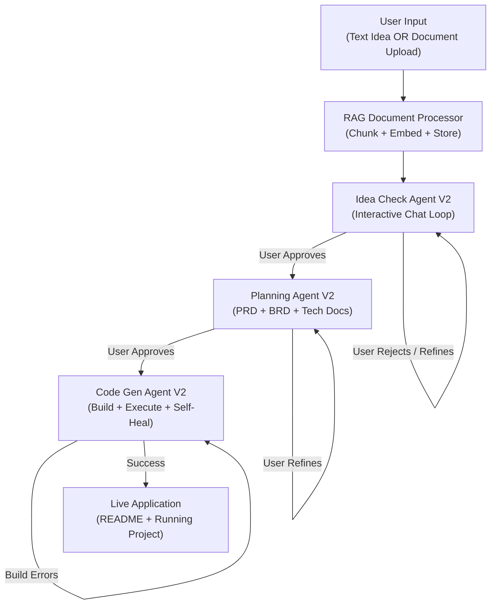

# Loom Multiverse — Agent Upgrade V3: Interactive Pipeline with RAG, Document Generation & Autonomous Code Execution

## Goal
Transform the current linear, fire-and-forget pipeline into an **interactive, human-in-the-loop, industry-grade software generation platform** — comparable to Lovable, Emergent, and Claude Artifacts. The three existing agents (Idea Check, Planning, Code Gen) will be upgraded with autonomous conversation loops, RAG document ingestion, professional document generation, and self-healing code execution.

---

## User Review Required

> [!IMPORTANT]
> **LLM Model Decision:** Your current setup uses `qwen2.5-coder:7b` on Ollama with 4GB VRAM (RTX 3050 Ti). For the RAG document ingestion feature, we do NOT need a separate trained model. We will use the existing `nomic-embed-text` embedding model (already installed) to chunk and embed uploaded documents into pgvector. The same Ollama model handles the reasoning. No new model download is needed for RAG. However, the upgraded prompts are significantly longer (especially Planning and Code Gen), so we should consider:
> - **Option A:** Stay with `qwen2.5-coder:7b` (current) — works but may produce lower quality for very complex projects
> - **Option B:** Pull `qwen2.5-coder:14b` if your system can handle it (needs ~10GB VRAM or CPU offload)
> - **Option C:** Use a cloud API key (Anthropic/OpenAI) for Tier 3 calls on Planning and Code Gen only, while keeping Idea Check on local Ollama

> [!WARNING]
> **Breaking Change — Pipeline Flow:** The current pipeline is fully automatic (`idea_check → planning → code_gen → END`). After this upgrade, the pipeline will **pause at each phase** and wait for user approval via WebSocket messages. The `test-runner.ts` will need to be updated to simulate user approvals, or a new interactive CLI runner will be created.

> [!IMPORTANT]
> **WebSocket Protocol Change:** The current WebSocket only broadcasts progress. After this upgrade, it will also need to **receive** user messages (chat responses, file uploads, approval signals). The dashboard frontend will need corresponding updates when it is built.

---

## Open Questions

> [!IMPORTANT]
> 1. **File Upload Size Limit:** For RAG document ingestion, what is the maximum document size you want to support? (e.g., 5MB, 20MB, unlimited?) This affects chunking strategy.
> 2. **Supported Document Formats:** Should we support only `.txt`, `.md`, `.pdf`? Or also `.docx`, `.pptx`? PDF and DOCX parsing require additional npm packages (`pdf-parse`, `mammoth`).
> 3. **Cloud API Key:** Do you have an Anthropic or OpenAI API key you'd like to use for the heavier Planning/CodeGen phases? Or should everything stay on local Ollama?
> 4. **Code Execution Environment:** The self-healing Code Gen agent needs to run `npm install` and `npm start` automatically. Should this run directly on your local machine (current approach via `child_process`), or should we set up E2B sandboxing for safety?

---

## Proposed Changes

### Overview of New Architecture



---

### Component 1: Shared Infrastructure (Foundation Layer)

These changes create the shared utilities that all three upgraded agents depend on.

---

#### [NEW] [`document-processor.ts`](file:///c:/Shashank/loom_multiverse/packages/agents/src/rag/document-processor.ts)

**Purpose:** RAG document ingestion pipeline. Accepts text files, markdown, and PDF uploads. Chunks them intelligently, embeds each chunk via `nomic-embed-text`, and stores in pgvector for semantic retrieval.

**Key logic:**
- **Chunking Strategy:** Recursive character text splitter (LangChain) with 1000-char chunks and 200-char overlap
- **Embedding:** Uses existing `embedBatch()` from `llm/embeddings.ts`
- **Storage:** Stores chunks in the `memory` table with namespace `"document_upload"` and metadata containing `{ fileName, chunkIndex, totalChunks }`
- **Supported formats:** `.txt`, `.md`, `.pdf` (via `pdf-parse` npm package)

```typescript
// Core interface
export interface DocumentProcessorResult {
  fileName: string;
  totalChunks: number;
  totalCharacters: number;
  summary: string; // LLM-generated summary of the document
}

export class DocumentProcessor {
  async ingest(projectId: string, filePath: string): Promise<DocumentProcessorResult>;
  async ingestFromText(projectId: string, text: string, fileName: string): Promise<DocumentProcessorResult>;
  async retrieveRelevantChunks(projectId: string, query: string, limit?: number): Promise<string[]>;
}
```

---

#### [NEW] [`rag-retriever.ts`](file:///c:/Shashank/loom_multiverse/packages/agents/src/rag/rag-retriever.ts)

**Purpose:** Unified RAG retriever that agents call to get relevant context from both uploaded documents and previously stored agent outputs.

**Key logic:**
- Accepts a natural language query and returns the top-K most relevant chunks
- Searches across multiple namespaces (`document_upload`, `idea_check_summary`, `technical_plan`)
- Returns formatted context strings ready to be injected into LLM prompts

---

#### [NEW] [`interactive-loop.ts`](file:///c:/Shashank/loom_multiverse/packages/agents/src/orchestrator/interactive-loop.ts)

**Purpose:** Reusable autonomous conversation loop that any agent can use to chat with the user until mutual approval is reached.

**Key logic:**
```typescript
export interface InteractiveLoopConfig {
  agentName: string;
  phase: string;
  projectId: string;
  systemPrompt: string;
  initialAgentMessage: string;
  onApproval: (finalOutput: unknown) => Promise<void>;
  onMessage?: (event: string, data: any) => void; // WebSocket broadcast
}

export class InteractiveLoop {
  async run(config: InteractiveLoopConfig): Promise<{ approved: boolean; finalOutput: unknown; chatHistory: Message[] }>;
  
  // For CLI/test mode: reads from stdin
  // For API mode: waits for WebSocket message
  private async waitForUserInput(): Promise<string>;
}
```

- **CLI Mode:** Uses `readline` to read user input from terminal (for `test-runner.ts`)
- **API Mode:** Pauses execution and waits for a WebSocket message of type `user:message` with the user's response
- **Approval Detection:** The agent LLM is prompted to detect when the user says "approved", "looks good", "proceed", etc. and also when the agent itself is satisfied

---

#### [MODIFY] [`state.ts`](file:///c:/Shashank/loom_multiverse/packages/agents/src/orchestrator/state.ts)

Add new state fields to support interactive loops and document uploads:
```diff
+ /** Chat history for human-in-the-loop interactions */
+ chatHistory: Annotation<Record<string, Message[]>>({
+   reducer: (x, y) => ({ ...x, ...y }),
+   default: () => ({}),
+ }),
+ 
+ /** Whether the user has uploaded documents */
+ uploadedDocuments: Annotation<string[]>({
+   reducer: (x, y) => [...(x || []), ...(y || [])],
+   default: () => [],
+ }),
+
+ /** User approval status per phase */
+ approvals: Annotation<Record<string, boolean>>({
+   reducer: (x, y) => ({ ...x, ...y }),
+   default: () => ({}),
+ }),
```

---

#### [MODIFY] [`types.ts`](file:///c:/Shashank/loom_multiverse/packages/agents/src/agents/types.ts)

Add new fields to `AgentInput` to support interactive mode:
```diff
  export interface AgentInput {
    projectId: string;
    phase: string;
    payload: Record<string, unknown>;
    llm?: BaseChatModel;
+   /** Callback for sending messages to the user (WebSocket/CLI) */
+   onMessage?: (event: string, data: any) => void;
+   /** Callback for receiving user input (WebSocket/CLI) */
+   waitForUserInput?: () => Promise<string>;
+   /** Whether to run in interactive mode (with user approval loops) */
+   interactive?: boolean;
  }
```

---

#### [MODIFY] [`runner.ts`](file:///c:/Shashank/loom_multiverse/packages/agents/src/orchestrator/runner.ts)

Update `RunPipelineOptions` to support:
- `initialDocuments?: string[]` — file paths to ingest before starting
- `interactive?: boolean` — whether to enable human-in-the-loop mode
- `rawIdea?: string` — can now be empty if documents are provided
- Wire up the `waitForUserInput` and `onMessage` callbacks through to agents

---

### Component 2: Upgraded Idea Check Agent (Phase 1)

---

#### [MODIFY] [`idea-check-agent.ts`](file:///c:/Shashank/loom_multiverse/packages/agents/src/agents/idea-check/idea-check-agent.ts)

**Current behavior:** Takes `rawIdea` string → asks LLM to validate → returns structured JSON → moves on.

**New behavior:**
1. **Input Acceptance:** Accepts EITHER a `rawIdea` text string OR a list of uploaded document paths (or both)
2. **RAG Ingestion:** If documents are provided, runs them through `DocumentProcessor` to chunk, embed, and store in pgvector
3. **Context Assembly:** Retrieves relevant chunks from the uploaded documents and combines with the raw idea text to build a comprehensive context for the LLM
4. **Interactive Chat Loop:** Instead of a single-shot LLM call:
   - The agent analyzes the idea and presents its verdict to the user
   - If the idea is NOT viable, the agent provides specific, actionable recommended changes
   - The user can accept the recommendations, provide their own modifications, or ask questions
   - The agent and user chat back-and-forth until BOTH agree on the final validated idea
   - Only then does the pipeline proceed to Planning
5. **Approval Gate:** The agent explicitly asks "Do you approve this validated idea? (yes/no)" and only proceeds on affirmative response

**Key changes in `execute()`:**
```typescript
protected async execute(input: AgentInput, llm: BaseChatModel): Promise<AgentResult> {
  // 1. Ingest documents if provided
  if (input.payload.documents) {
    const processor = new DocumentProcessor();
    for (const doc of input.payload.documents) {
      await processor.ingest(input.projectId, doc);
    }
  }
  
  // 2. Build context from RAG + raw idea
  const ragContext = await retriever.retrieveRelevantChunks(input.projectId, rawIdea);
  const fullContext = `${rawIdea}\n\nAdditional Context from Documents:\n${ragContext}`;
  
  // 3. Run interactive loop
  const loop = new InteractiveLoop();
  const result = await loop.run({
    agentName: "Idea Check Agent",
    phase: "idea_check",
    projectId: input.projectId,
    systemPrompt: INTERACTIVE_SYSTEM_PROMPT,
    initialAgentMessage: "I've analyzed your idea. Here is my assessment...",
    onMessage: input.onMessage,
  });
  
  return { success: true, data: { validatedIdea: result.finalOutput } };
}
```

---

#### [MODIFY] [`idea-check/prompts.ts`](file:///c:/Shashank/loom_multiverse/packages/agents/src/agents/idea-check/prompts.ts)

Overhaul the prompts to support the interactive conversational mode:
- New `INTERACTIVE_SYSTEM_PROMPT` that instructs the LLM to act as a collaborative idea refinement partner
- New `DOCUMENT_ANALYSIS_PROMPT` for when the user uploads documents instead of typing text
- The prompt instructs the LLM to output recommendations in a structured format when the idea needs changes

---

### Component 3: Upgraded Planning Agent (Phase 2)

---

#### [MODIFY] [`planning-agent.ts`](file:///c:/Shashank/loom_multiverse/packages/agents/src/agents/planning/planning-agent.ts)

**Current behavior:** Takes validated idea context → generates single JSON technical plan → stores in vector memory → moves on.

**New behavior:**
1. **Multi-Document Generation:** Instead of a single JSON blob, generates three separate, comprehensive, industry-grade documents:
   - **PRD (Product Requirements Document):** User stories, acceptance criteria, feature prioritization (MoSCoW), success metrics, constraints
   - **BRD (Business Requirements Document):** Only generated if the project has business/revenue components (e-commerce, SaaS, marketplace). Contains business objectives, stakeholder analysis, ROI projections, compliance requirements
   - **Technical Architecture Document:** System architecture, database schema, API design, tech stack rationale (ADRs), deployment strategy, security considerations, scalability plan
2. **File Output:** All documents are written as `.md` files directly into the project workspace (`runs/workspaces/<projectId>/docs/`)
3. **Interactive Chat Loop:** Same as Idea Check:
   - Agent presents the generated documents to the user
   - User can request changes to specific sections ("Make the database schema use MongoDB instead of PostgreSQL")
   - Agent makes changes in real-time and updates the `.md` files
   - Loop continues until user approves all documents
4. **RAG Context:** Uses the RAG retriever to pull relevant context from the uploaded documents AND the validated idea from Phase 1

**New document generation flow:**
```typescript
protected async execute(input: AgentInput, llm: BaseChatModel): Promise<AgentResult> {
  const ideaContext = input.payload.validatedIdea;
  
  // 1. Generate PRD
  const prd = await this.generatePRD(ideaContext, llm);
  await this.writeDocument(workspacePath, "docs/PRD.md", prd);
  
  // 2. Generate BRD (conditional)
  if (this.requiresBRD(ideaContext)) {
    const brd = await this.generateBRD(ideaContext, llm);
    await this.writeDocument(workspacePath, "docs/BRD.md", brd);
  }
  
  // 3. Generate Technical Architecture Document
  const techDoc = await this.generateTechDoc(ideaContext, llm);
  await this.writeDocument(workspacePath, "docs/TECHNICAL_ARCHITECTURE.md", techDoc);
  
  // 4. Interactive review loop
  const loop = new InteractiveLoop();
  const result = await loop.run({
    agentName: "Planning Agent",
    phase: "planning",
    initialAgentMessage: "I've generated the following project documents...",
    onApproval: async () => { /* store final plan in vector memory */ },
  });
  
  return { success: true, data: { technicalPlan: result.finalOutput, documents: generatedPaths } };
}
```

---

#### [MODIFY] [`planning/prompts.ts`](file:///c:/Shashank/loom_multiverse/packages/agents/src/agents/planning/prompts.ts)

Complete overhaul with three new prompt sets:
- `PRD_SYSTEM_PROMPT` — Industry-grade PRD generation with user stories in Given/When/Then format, MoSCoW prioritization, acceptance criteria
- `BRD_SYSTEM_PROMPT` — Business-focused document with stakeholder matrix, KPIs, compliance requirements
- `TECH_DOC_SYSTEM_PROMPT` — Deep technical document with C4 architecture diagrams, database ER diagrams, API contracts (OpenAPI-style), security threat model
- `INTERACTIVE_PLANNING_PROMPT` — Conversational mode for document revision

---

### Component 4: Upgraded Code Gen Agent (Phase 3)

---

#### [MODIFY] [`code-gen-agent.ts`](file:///c:/Shashank/loom_multiverse/packages/agents/src/agents/code-gen/code-gen-agent.ts)

**Current behavior:** Generates file structure → iterates and writes each file → returns list of generated files → done.

**New behavior:**
1. **Document-Aware Generation:** Reads the PRD, BRD, and Technical Architecture documents from the workspace `docs/` folder to guide code generation with maximum context
2. **UI/UX Excellence:** The Code Gen agent now has a dedicated "Senior UI/UX Developer" persona. For frontend files, the prompt is enhanced with modern design principles (glassmorphism, micro-animations, responsive layouts, premium color palettes)
3. **Technology-Agnostic:** Instead of hardcoding React, the agent reads the tech stack from the Technical Architecture Document and adapts. It can generate:
   - React / Next.js (web)
   - React Native / Expo (mobile)
   - Vue.js / Nuxt (web)
   - Express / Fastify / Hono (backend)
   - Any stack the planning agent decided on
4. **README Generation:** After all files are written, generates a comprehensive `README.md` with:
   - Project overview, features list
   - Tech stack table
   - Setup instructions (prerequisites, environment variables)
   - All commands to install and run (dev, build, test, deploy)
   - API documentation summary
   - Contributing guidelines
5. **Autonomous Self-Healing Execution Loop:**
   ```
   LOOP:
     1. Run `npm install` (or equivalent for the tech stack)
     2. If install fails → read error → fix package.json → GOTO 1
     3. Run `npm run dev` (or equivalent)
     4. If build/compile fails → read error → identify broken file → regenerate file → GOTO 3
     5. If server starts successfully → verify with HTTP health check → EXIT LOOP
   ```
   - Maximum retry limit: 10 iterations (configurable)
   - Each iteration logs the error and the fix applied
   - Uses `child_process.exec` to run commands in the workspace directory
   - Captures stdout/stderr and feeds errors back to the LLM for diagnosis

**New execution flow:**
```typescript
protected async execute(input: AgentInput, llm: BaseChatModel): Promise<AgentResult> {
  // 1. Read planning documents from workspace
  const docs = await this.readPlanningDocs(workspacePath);
  
  // 2. Generate file structure (enhanced with docs context)
  const structure = await this.generateFileStructure(docs, llm);
  
  // 3. Generate each file (with UI/UX persona for frontend files)
  for (const file of structure.files) {
    await this.generateAndWriteFile(file, docs, llm);
  }
  
  // 4. Generate README.md
  await this.generateReadme(workspacePath, structure, docs, llm);
  
  // 5. Self-healing execution loop
  const execResult = await this.selfHealingExecute(workspacePath, llm);
  
  return {
    success: true,
    data: {
      generatedFiles: structure.files.map(f => f.path),
      workspaceRoot: workspacePath,
      executionLog: execResult.log,
      isRunning: execResult.success,
    },
  };
}

private async selfHealingExecute(workspacePath: string, llm: BaseChatModel): Promise<ExecutionResult> {
  const MAX_RETRIES = 10;
  
  for (let attempt = 1; attempt <= MAX_RETRIES; attempt++) {
    // Install dependencies
    const installResult = await this.runCommand("npm install", workspacePath);
    if (!installResult.success) {
      const fix = await this.diagnoseAndFix(installResult.error, "install", llm);
      await this.applyFix(fix, workspacePath);
      continue;
    }
    
    // Start the application
    const startResult = await this.runCommand("npm run dev", workspacePath, { timeout: 30000 });
    if (!startResult.success) {
      const fix = await this.diagnoseAndFix(startResult.error, "runtime", llm);
      await this.applyFix(fix, workspacePath);
      continue;
    }
    
    return { success: true, log: `Application started successfully on attempt ${attempt}` };
  }
  
  return { success: false, log: `Failed to start after ${MAX_RETRIES} attempts` };
}
```

---

#### [MODIFY] [`code-gen/prompts.ts`](file:///c:/Shashank/loom_multiverse/packages/agents/src/agents/code-gen/prompts.ts)

Major prompt overhaul:
- `FILE_STRUCTURE_PROMPT` — Enhanced to read from planning docs instead of raw JSON
- `FILE_GENERATION_PROMPT` — Enhanced with UI/UX design principles for frontend files
- `UI_UX_PERSONA_PROMPT` — New dedicated prompt for generating beautiful, modern UI code
- `README_GENERATION_PROMPT` — New prompt for comprehensive README.md
- `ERROR_DIAGNOSIS_PROMPT` — New prompt for the self-healing loop (reads error output, identifies root cause, generates fix)

---

#### [NEW] [`code-gen/executor.ts`](file:///c:/Shashank/loom_multiverse/packages/agents/src/agents/code-gen/executor.ts)

**Purpose:** Encapsulates the self-healing code execution logic. Runs shell commands, captures output, feeds errors to LLM, applies fixes.

```typescript
export class CodeExecutor {
  async runCommand(command: string, cwd: string, options?: { timeout?: number }): Promise<CommandResult>;
  async diagnoseError(error: string, context: string, llm: BaseChatModel): Promise<CodeFix>;
  async applyFix(fix: CodeFix, workspacePath: string): Promise<void>;
  async healthCheck(port: number): Promise<boolean>;
}
```

---

### Component 5: Orchestrator Graph Update

---

#### [MODIFY] [`graph.ts`](file:///c:/Shashank/loom_multiverse/packages/agents/src/orchestrator/graph.ts)

Update the LangGraph state machine to support:
1. **Human-in-the-loop interrupts:** After each phase node, add a conditional edge that checks if user approval has been received
2. **Document ingestion node:** New node at the start that processes uploaded documents before entering the pipeline
3. **Error recovery edges:** If a phase fails, route back to itself (with error context) instead of going to END

```diff
  const workflow = new StateGraph(OrchestratorState)
+   .addNode("document_ingestion", documentIngestionNode)
    .addNode("idea_check", ideaCheckNode)
    .addNode("planning", planningNode)
    .addNode("code_gen", codeGenNode)
    
-   .addEdge("__start__", "idea_check")
+   .addEdge("__start__", "document_ingestion")
+   .addConditionalEdges("document_ingestion", routeAfterDocIngestion)
    .addConditionalEdges("idea_check", routeAfterIdeaCheck)
    .addConditionalEdges("planning", routeAfterPlanning)
    .addConditionalEdges("code_gen", routeAfterCodeGen);
```

---

### Component 6: API & WebSocket Updates

---

#### [MODIFY] [`pipeline.ts`](file:///c:/Shashank/loom_multiverse/apps/api/src/routes/pipeline.ts)

Add new endpoints:
- `POST /pipeline/:projectId/start` — Now accepts `multipart/form-data` with optional file uploads
- `POST /pipeline/:projectId/message` — Send a chat message to the running pipeline (for interactive loop)
- `POST /pipeline/:projectId/approve` — Explicitly approve the current phase
- `GET /pipeline/:projectId/documents` — List generated documents (PRD, BRD, Tech Doc)

---

#### [MODIFY] [`pipeline-stream.ts`](file:///c:/Shashank/loom_multiverse/apps/api/src/ws/pipeline-stream.ts)

Upgrade WebSocket to be bidirectional:
- **Server → Client:** `pipeline:progress`, `agent:message`, `agent:waiting_for_input`, `phase:completed`
- **Client → Server:** `user:message`, `user:approve`, `user:upload`

---

### Component 7: New Dependencies

#### [MODIFY] [`packages/agents/package.json`](file:///c:/Shashank/loom_multiverse/packages/agents/package.json)

```diff
+ "pdf-parse": "^1.1.1",           // PDF document parsing for RAG
+ "@langchain/textsplitters": "^0.1.0",  // Text chunking for RAG
+ "tree-kill": "^1.2.2",            // Kill process trees for self-healing executor
```

---

### Component 8: Interactive Test Runner

---

#### [MODIFY] [`test-runner.ts`](file:///c:/Shashank/loom_multiverse/packages/agents/src/orchestrator/test-runner.ts)

Replace the current fire-and-forget test runner with an interactive CLI version:
- Uses `readline` to accept user input from the terminal
- Displays agent messages in styled terminal output
- Supports file path input for document uploads
- Allows the user to type responses during the interactive loops
- Displays generated documents inline

---

## New File Summary

| File | Purpose |
|------|---------|
| `packages/agents/src/rag/document-processor.ts` | RAG document ingestion (chunk, embed, store) |
| `packages/agents/src/rag/rag-retriever.ts` | Unified semantic search across all memory |
| `packages/agents/src/rag/index.ts` | RAG module exports |
| `packages/agents/src/orchestrator/interactive-loop.ts` | Reusable human-in-the-loop conversation manager |
| `packages/agents/src/agents/code-gen/executor.ts` | Self-healing code execution engine |

## Modified File Summary

| File | Change |
|------|--------|
| `packages/agents/src/orchestrator/state.ts` | Add chatHistory, uploadedDocuments, approvals |
| `packages/agents/src/agents/types.ts` | Add onMessage, waitForUserInput, interactive |
| `packages/agents/src/orchestrator/runner.ts` | Support documents, interactive mode |
| `packages/agents/src/orchestrator/graph.ts` | Add document_ingestion node, approval gates |
| `packages/agents/src/agents/idea-check/idea-check-agent.ts` | RAG + interactive loop |
| `packages/agents/src/agents/idea-check/prompts.ts` | Interactive + document analysis prompts |
| `packages/agents/src/agents/planning/planning-agent.ts` | Multi-doc generation + interactive loop |
| `packages/agents/src/agents/planning/prompts.ts` | PRD/BRD/TechDoc prompts |
| `packages/agents/src/agents/code-gen/code-gen-agent.ts` | Doc-aware + self-healing execution |
| `packages/agents/src/agents/code-gen/prompts.ts` | UI/UX persona + error diagnosis prompts |
| `packages/agents/src/agents/index.ts` | Export new RAG modules |
| `packages/agents/src/orchestrator/test-runner.ts` | Interactive CLI mode |
| `apps/api/src/routes/pipeline.ts` | File upload + message endpoints |
| `apps/api/src/ws/pipeline-stream.ts` | Bidirectional WebSocket |

---

## Verification Plan

### Automated Tests
```bash
# 1. Build the entire monorepo to verify TypeScript compilation
pnpm build

# 2. Run the interactive test runner with a text idea
npx tsx --env-file=.env packages/agents/src/orchestrator/test-runner.ts

# 3. Run the interactive test runner with a document upload
npx tsx --env-file=.env packages/agents/src/orchestrator/test-runner.ts --document ./sample-project-brief.md
```

### Manual Verification
1. **Idea Check Loop:** Start pipeline → type an intentionally vague idea → verify the agent rejects it and suggests improvements → refine the idea → verify approval flow works
2. **Document Upload:** Start pipeline with a PDF/MD document → verify chunks appear in pgvector → verify the agent references the document content in its analysis
3. **Planning Documents:** After idea approval → verify `docs/PRD.md`, `docs/BRD.md`, `docs/TECHNICAL_ARCHITECTURE.md` are created in the workspace → verify they are comprehensive, not placeholder
4. **Code Gen Self-Healing:** After planning approval → verify code is generated → verify `npm install` runs → verify errors are caught and fixed → verify the project eventually starts
5. **README:** Verify `README.md` is generated with correct commands

---

## Execution Order

The implementation should proceed in this exact order due to dependencies:

1. **Foundation:** `types.ts` → `state.ts` → `interactive-loop.ts` → `rag/document-processor.ts` → `rag/rag-retriever.ts`
2. **Idea Check V2:** `idea-check/prompts.ts` → `idea-check/idea-check-agent.ts`
3. **Planning V2:** `planning/prompts.ts` → `planning/planning-agent.ts`
4. **Code Gen V2:** `code-gen/prompts.ts` → `code-gen/executor.ts` → `code-gen/code-gen-agent.ts`
5. **Orchestrator:** `graph.ts` → `runner.ts` → `test-runner.ts`
6. **API Layer:** `pipeline.ts` → `pipeline-stream.ts`
7. **Verification:** Build → test run → iterate
