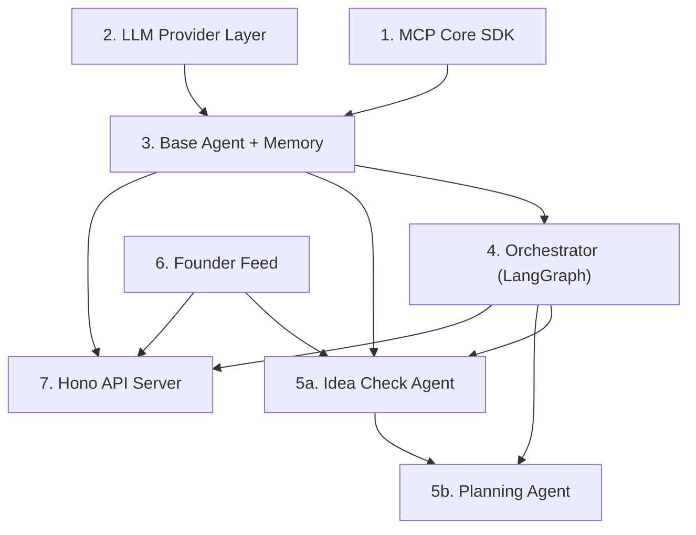

# Phase B — Core Engine: Implementation Plan

> Build the foundational runtime: MCP protocol SDK, agent base class with memory, the LangGraph orchestrator, the first two phase agents (Idea Check + Planning), the Founder Feed news aggregator, and the Hono API server.

## Scope & Build Order

Phase B has **6 major components** that must be built in strict dependency order (bottom-up). Each component is fully testable before moving to the next.



| # | Component | Package | New Files | Est. Lines |
|---|-----------|---------|-----------|------------|
| 1 | MCP Core SDK | `packages/mcp-core/` | 5 | ~400 |
| 2 | LLM Provider Layer | `packages/agents/` | 3 | ~350 |
| 3 | Base Agent + Memory | `packages/agents/` | 4 | ~500 |
| 4 | Orchestrator (LangGraph) | `packages/agents/` | 4 | ~600 |
| 5a | Idea Check Agent | `packages/agents/` | 3 | ~700 |
| 5b | Planning Agent | `packages/agents/` | 3 | ~800 |
| 6 | Founder Feed | `packages/founder-feed/` | 8 | ~900 |
| 7 | Hono API Server | `apps/api/` | 8 | ~700 |

---

## User Review Required

> [!IMPORTANT]
> **Real-time validation requirement**: You asked that each agent be verified for real accuracy before building the next. After each agent is coded, I will run it against your local Ollama `qwen3:4b` with a sample founder prompt. We will look at the actual LLM output together and confirm it's producing quality results — not dummy/template responses — before proceeding.

> [!WARNING]
> **Hardware constraint**: Your RTX 3050 Ti has 4 GB VRAM. The `qwen3:4b` model fits well, but `qwen3:8b` may need CPU offloading and will be slower. I will default all agents to `qwen3:4b` for development and testing. We can swap models later once the pipeline is stable.

> [!IMPORTANT]
> **Ollama must be running** for any agent test. Before each verification step, I will check that `ollama serve` is active and the model is loaded.

---

## Open Questions

> [!IMPORTANT]
> **Q1: Sample project idea for testing.** When we test the Idea Check Agent and Planning Agent, I need a founder prompt to feed into them. Would you like me to use a sample idea (e.g., *"An AI-powered resume builder for fresh graduates"*), or do you have a specific idea you'd like to test with?

> [!IMPORTANT]
> **Q2: Founder Feed — live vs mock for now?** The RSS scrapers need internet access and some sources may have changed their feeds. Should I:
> - **(a)** Build the full live scraper now and test against real RSS feeds, or
> - **(b)** Build the scraper with a mock/cache layer first so development isn't blocked by network issues, then enable live mode after agents are working?

---

## Proposed Changes

### Component 1: MCP Core SDK (`packages/mcp-core/`)

This is the Model Context Protocol SDK that lets agents invoke tools exposed by MCP servers. It provides a typed server builder and a typed client that agents use to call tools.

#### [NEW] [`packages/mcp-core/src/server.ts`](file:///c:/Shashank/loom_multiverse/packages/mcp-core/src/server.ts)
**MCP Server Builder** — Wraps `@modelcontextprotocol/sdk` with Loom-specific conventions:
- `createMcpServer(name, version)` factory function
- `registerTool(name, description, zodSchema, handler)` — type-safe tool registration with Zod validation
- Built-in error handling that maps errors to `MCPError` from `@loom/shared/errors`
- Structured logging via `createLogger("mcp-server:<name>")`
- Health check tool auto-registered on every server

#### [NEW] [`packages/mcp-core/src/client.ts`](file:///c:/Shashank/loom_multiverse/packages/mcp-core/src/client.ts)
**MCP Client** — Used by agents to discover and invoke tools on MCP servers:
- `McpClient` class with `connect(serverName)`, `listTools()`, `callTool(name, args)` methods
- Connection pooling and automatic reconnection
- Request timeout handling (configurable, default 30s)
- Response parsing with type inference from Zod schemas
- Error wrapping into `MCPError` with server name context

#### [NEW] [`packages/mcp-core/src/types.ts`](file:///c:/Shashank/loom_multiverse/packages/mcp-core/src/types.ts)
**Shared MCP types:**
- `ToolDefinition` — name, description, input schema, server name
- `ToolResult` — content array with text/image types
- `McpServerConfig` — name, version, transport config
- `McpClientConfig` — server URL, timeout, retry policy

#### [NEW] [`packages/mcp-core/src/transport.ts`](file:///c:/Shashank/loom_multiverse/packages/mcp-core/src/transport.ts)
**Transport layer** — Abstraction over stdio and SSE transports:
- `StdioTransport` — for local process-based MCP servers
- `SSETransport` — for remote HTTP-based MCP servers
- Transport factory based on config

#### [NEW] [`packages/mcp-core/src/index.ts`](file:///c:/Shashank/loom_multiverse/packages/mcp-core/src/index.ts)
**Barrel export** — Re-exports server, client, types, and transport.

---

### Component 2: LLM Provider Layer (`packages/agents/`)

A provider-agnostic LLM abstraction that routes to Ollama (free, local) or cloud APIs (paid fallback) based on `config.LLM_PROVIDER`. This is the "brain" of every agent.

#### [NEW] [`packages/agents/src/llm/provider.ts`](file:///c:/Shashank/loom_multiverse/packages/agents/src/llm/provider.ts)
**LLM Provider Factory:**
- `createLLM(options)` — returns a LangChain `BaseChatModel` instance
- Options: `{ provider, model, temperature, maxTokens, structuredOutput? }`
- Provider routing:
  - `"ollama"` → `ChatOllama` from `@langchain/ollama` (connects to `OLLAMA_BASE_URL`)
  - `"anthropic"` → `ChatAnthropic` from `@langchain/anthropic`
  - `"openai"` → `ChatOpenAI` from `@langchain/openai`
- Default: reads `config.LLM_PROVIDER` and `config.OLLAMA_MODEL`
- **3-tier model selection:**
  - `tier1()` → `qwen3:4b` (fast tasks: classification, extraction)
  - `tier2()` → `qwen3:8b` (complex reasoning: architecture, code gen)
  - `tier3()` → Cloud fallback (only if API key is present)
- Structured output support via `.withStructuredOutput(zodSchema)` — forces the LLM to return JSON matching the schema

#### [NEW] [`packages/agents/src/llm/embeddings.ts`](file:///c:/Shashank/loom_multiverse/packages/agents/src/llm/embeddings.ts)
**Embedding Provider:**
- `createEmbeddings(options)` — returns a LangChain `Embeddings` instance
- Routes to `OllamaEmbeddings` (768d, free) or `OpenAIEmbeddings` (1536d, paid) based on `config.EMBEDDING_PROVIDER`
- `embedText(text)` — embed a single string
- `embedBatch(texts)` — embed multiple strings with batching (avoids Ollama overload on 4GB VRAM)

#### [NEW] [`packages/agents/src/llm/index.ts`](file:///c:/Shashank/loom_multiverse/packages/agents/src/llm/index.ts)
**Barrel export** for the LLM layer.

---

### Component 3: Base Agent + Memory (`packages/agents/`)

The abstract base class that every phase agent extends. Provides memory (vector store), LLM access, MCP tool invocation, ADR writing, and structured logging.

#### [NEW] [`packages/agents/src/agents/base-agent.ts`](file:///c:/Shashank/loom_multiverse/packages/agents/src/agents/base-agent.ts)
**BaseAgent abstract class:**
```typescript
abstract class BaseAgent {
  // Identity
  readonly role: AgentRole;
  readonly displayName: string;
  protected systemPrompt: string;

  // Dependencies (injected)
  protected logger: Logger;
  protected db: Database;
  protected vectorStore: VectorStore;
  protected llm: BaseChatModel;
  protected embeddings: Embeddings;

  // Abstract — each agent implements this
  abstract execute(input: PhaseInput): Promise<PhaseResult>;

  // Memory helpers
  protected async remember(content, namespace, metadata?): Promise<void>;
  protected async recall(query, namespace, options?): Promise<MemoryEntry[]>;
  
  // ADR helpers
  protected async writeADR(adr: ADRInput): Promise<string>;
  protected async getADRs(projectId): Promise<ADRRecord[]>;

  // Phase tracking
  protected async startPhase(projectId, phaseType): Promise<string>;
  protected async completePhase(phaseId, result): Promise<void>;
  protected async failPhase(phaseId, error): Promise<void>;

  // LLM helpers (convenience wrappers)
  protected async ask(prompt, options?): Promise<string>;
  protected async askStructured<T>(prompt, schema: ZodSchema<T>): Promise<T>;
  protected async askWithMemory(prompt, projectId, namespace): Promise<string>;
}
```

Key design decisions:
- **Dependency injection** — DB, vectorStore, LLM, and embeddings are injected via constructor, not hard-coded. This makes testing trivial (mock the dependencies).
- **Memory-augmented prompts** — `askWithMemory()` automatically recalls relevant context from vector store and injects it into the system prompt before calling the LLM.
- **Structured output** — `askStructured()` uses Zod schemas to force deterministic JSON output from the LLM. Critical for inter-agent communication.
- **Phase lifecycle** — `startPhase()` / `completePhase()` / `failPhase()` write to the `phases` table for audit trail and progress tracking.

#### [NEW] [`packages/agents/src/agents/types.ts`](file:///c:/Shashank/loom_multiverse/packages/agents/src/agents/types.ts)
**Agent-specific types:**
- `PhaseInput` — what the orchestrator passes to an agent (projectId, founderPrompt, previousResults, feedAlerts)
- `AgentConfig` — role, model, temperature, tools, systemPrompt
- `MemoryEntry` — content, similarity score, metadata, timestamp
- `ADRInput` — title, context, decision, rationale, consequences

#### [NEW] [`packages/agents/src/agents/agent-registry.ts`](file:///c:/Shashank/loom_multiverse/packages/agents/src/agents/agent-registry.ts)
**Agent Registry** — singleton that holds all instantiated agents:
- `registerAgent(role, agent)` — register an agent instance
- `getAgent(role)` — retrieve by role
- `getAllAgents()` — list all registered agents
- Used by the Orchestrator to dispatch work to the correct agent

#### [NEW] [`packages/agents/src/agents/index.ts`](file:///c:/Shashank/loom_multiverse/packages/agents/src/agents/index.ts)
**Barrel export** for the agents module.

---

### Component 4: Orchestrator (`packages/agents/`)

The LangGraph.js state machine that coordinates all phase agents. This is the "brain" of the entire system.

#### [NEW] [`packages/agents/src/orchestrator/state.ts`](file:///c:/Shashank/loom_multiverse/packages/agents/src/orchestrator/state.ts)
**Typed State Schema** — defines the state that flows through the LangGraph graph:
```typescript
interface OrchestratorState {
  // Project identity
  projectId: string;
  founderPrompt: string;
  projectName: string;

  // Pipeline state
  currentPhase: PhaseType;
  phaseResults: Record<PhaseType, PhaseResult | null>;
  completedPhases: PhaseType[];

  // Feed & alerts
  feedAlerts: FeedItem[];
  competitorWarnings: string[];

  // Decision records
  adrs: ADRRecord[];

  // Control flow
  shouldPivot: boolean;
  needsRedesign: boolean;
  needsRebuild: boolean;
  iterationCount: number;
  maxIterations: number;

  // Error handling
  error: string | null;
  status: "running" | "paused" | "completed" | "failed";
}
```

Uses LangGraph's `Annotation` API for typed, reducible state channels. Each field has a defined reducer (e.g., `phaseResults` uses merge, `completedPhases` uses append).

#### [NEW] [`packages/agents/src/orchestrator/graph.ts`](file:///c:/Shashank/loom_multiverse/packages/agents/src/orchestrator/graph.ts)
**LangGraph Graph Definition:**
- **Nodes** (one per phase + control nodes):
  - `initProject` — creates the project in DB, initializes state
  - `checkFeed` — queries Founder Feed for competitor/market alerts
  - `ideaCheck` — invokes Phase 1 agent
  - `evaluateIdeaCheck` — decides: proceed, pivot, or fail
  - `planning` — invokes Phase 2 agent
  - `evaluatePlanning` — decides: proceed or re-plan
  - *(Phase 3-6 nodes will be added in Phase C)*
  - `complete` — marks project as deployed

- **Edges** (conditional routing):
  ```
  START → initProject → checkFeed → ideaCheck → evaluateIdeaCheck
  evaluateIdeaCheck → { planning | ideaCheck (pivot) | END (reject) }
  planning → evaluatePlanning → { design | planning (revise) }
  ```

- **Conditional edge functions**:
  - `shouldPivot(state)` — returns true if Feed found a direct competitor launch
  - `isIdeaViable(state)` — checks the Idea Check Agent's confidence score
  - `isPlanComplete(state)` — validates that the Planning Agent produced all required artifacts
  - `shouldRetry(state)` — checks iteration count against `maxIterations`

#### [NEW] [`packages/agents/src/orchestrator/runner.ts`](file:///c:/Shashank/loom_multiverse/packages/agents/src/orchestrator/runner.ts)
**Orchestrator Runner:**
- `runPipeline(founderPrompt, options?)` — entry point that creates a project and runs the graph
- `resumePipeline(projectId)` — resumes a paused pipeline from the last checkpoint
- State checkpointing — saves state to DB after each node execution (crash recovery)
- Event emitter — emits `phase:start`, `phase:complete`, `phase:error` events for the API to stream to the dashboard
- Timeout handling — kills a phase if it exceeds `DEFAULT_PHASE_TIMEOUT_MS`

#### [NEW] [`packages/agents/src/orchestrator/index.ts`](file:///c:/Shashank/loom_multiverse/packages/agents/src/orchestrator/index.ts)
**Barrel export** for the orchestrator module.

---

### Component 5a: Idea Check Agent (`packages/agents/`)

The first phase agent. It takes the founder's raw idea and performs **real market validation** — not a dummy response. It uses the LLM to analyze viability, competition, uniqueness, and feasibility.

#### [NEW] [`packages/agents/src/agents/idea-check/idea-check-agent.ts`](file:///c:/Shashank/loom_multiverse/packages/agents/src/agents/idea-check/idea-check-agent.ts)
**IdeaCheckAgent extends BaseAgent:**

**What it does (advanced, not basic):**
1. **Parses the founder prompt** — extracts: product name, target audience, core problem, proposed solution, domain/industry
2. **Competitor analysis** — queries Founder Feed for recent articles about similar products or competitors in the same domain
3. **Market validation** — uses the LLM to assess:
   - Is this a real problem? (Problem-Solution Fit score 0-100)
   - How crowded is this market? (Competition density: low/medium/high)
   - What's the unique differentiator? (Moat analysis)
   - Who is the ideal user persona?
   - What are the top 3 risks?
4. **Technical feasibility** — estimates complexity, tech stack recommendation, time-to-MVP
5. **CTO Pushback** — if the Feed found a direct competitor that just launched, it flags a warning and asks the founder to confirm before proceeding
6. **Produces a structured `IdeaCheckResult`** (not free-text):

```typescript
// Zod schema forces deterministic output
const IdeaCheckResultSchema = z.object({
  isViable: z.boolean(),
  confidenceScore: z.number().min(0).max(100),
  productName: z.string(),
  targetAudience: z.string(),
  coreProblem: z.string(),
  proposedSolution: z.string(),
  domain: z.string(),
  competition: z.object({
    density: z.enum(["low", "medium", "high"]),
    topCompetitors: z.array(z.string()),
    differentiator: z.string(),
  }),
  risks: z.array(z.object({
    risk: z.string(),
    severity: z.enum(["low", "medium", "high"]),
    mitigation: z.string(),
  })),
  techFeasibility: z.object({
    complexity: z.enum(["simple", "moderate", "complex"]),
    estimatedWeeks: z.number(),
    recommendedStack: z.array(z.string()),
  }),
  pivotSuggestions: z.array(z.string()).optional(),
  summary: z.string(),
});
```

7. **Stores results in memory** — writes the analysis into the vector store so the Planning Agent can recall it

#### [NEW] [`packages/agents/src/agents/idea-check/prompts.ts`](file:///c:/Shashank/loom_multiverse/packages/agents/src/agents/idea-check/prompts.ts)
**System and task prompts:**
- Multi-section system prompt that instructs the LLM to act as a senior product strategist + CTO
- Structured output instructions with the exact JSON schema
- Context injection template for Feed alerts
- Few-shot examples for high-quality output

#### [NEW] [`packages/agents/src/agents/idea-check/index.ts`](file:///c:/Shashank/loom_multiverse/packages/agents/src/agents/idea-check/index.ts)
**Barrel export.**

---

### Component 5b: Planning Agent (`packages/agents/`)

Takes the validated idea from the Idea Check Agent and produces a **complete technical specification** — architecture, database schema, API design, component tree, and a phased development plan.

#### [NEW] [`packages/agents/src/agents/planning/planning-agent.ts`](file:///c:/Shashank/loom_multiverse/packages/agents/src/agents/planning/planning-agent.ts)
**PlanningAgent extends BaseAgent:**

**What it does (advanced):**
1. **Recalls Idea Check results** from vector memory
2. **Generates a full technical spec** with these sections:
   - **Architecture Design** — system diagram, service boundaries, data flow
   - **Tech Stack Decision** — framework, database, hosting, auth (writes ADRs for each decision)
   - **Database Schema** — tables, relationships, indexes (ERD-level detail)
   - **API Design** — endpoints, request/response schemas, auth flow
   - **Component Tree** — UI component hierarchy (for the Design Agent)
   - **File Structure** — exact directory tree with file descriptions
   - **Development Phases** — ordered list of implementation steps
   - **Non-Functional Requirements** — performance targets, security checklist

3. **Writes ADRs** — for every architectural decision (e.g., "Chose Next.js over Vite because..."), persists them to the `adrs` table
4. **Produces structured `PlanningResult` (Industry-Grade V2)**:

```typescript
const PlanningResultSchema = z.object({
  projectName: z.string(),
  architecture: z.object({
    type: z.enum(["monolith", "microservices", "serverless", "jamstack"]),
    diagramMermaid: z.string(), // Complete Mermaid.js flowchart or architecture diagram
    services: z.array(z.object({
      name: z.string(),
      responsibility: z.string(),
      techStack: z.array(z.string()),
    })),
  }),
  techStack: z.object({
    frontend: z.array(z.string()),
    backend: z.array(z.string()),
    database: z.array(z.string()),
    infrastructure: z.array(z.string()),
  }),
  databaseSchema: z.object({
    diagramMermaid: z.string(), // Complete Mermaid.js ER Diagram (erDiagram)
    tables: z.array(z.object({
      tableName: z.string(),
      columns: z.array(z.object({
        name: z.string(),
        type: z.string(),
        description: z.string(),
      })),
      description: z.string(),
    })),
  }),
  apiEndpoints: z.array(z.object({
    method: z.enum(["GET", "POST", "PUT", "PATCH", "DELETE"]),
    path: z.string(),
    description: z.string(),
    auth: z.boolean(),
  })),
  nonFunctionalRequirements: z.array(z.object({
    category: z.string(),
    requirements: z.array(z.string()),
  })),
  developmentPhases: z.array(z.object({
    phaseName: z.string(),
    tasks: z.array(z.string()),
  })),
  potentialChallenges: z.array(z.string()),
});
```

5. **Stores the full plan in memory** for the Design and Build agents to recall later

#### [NEW] [`packages/agents/src/agents/planning/prompts.ts`](file:///c:/Shashank/loom_multiverse/packages/agents/src/agents/planning/prompts.ts)
**System and task prompts:**
- Expert senior architect system prompt
- Retrieval-augmented prompt that injects Idea Check results from memory
- Structured output instructions
- ADR template injection

#### [NEW] [`packages/agents/src/agents/planning/index.ts`](file:///c:/Shashank/loom_multiverse/packages/agents/src/agents/planning/index.ts)
**Barrel export.**

---

### Component 6: Founder Feed (`packages/founder-feed/`)

The news aggregator that scrapes legitimate sources and scores articles by relevance to the founder's project domain. Powers the "CTO Pushback" feature.

#### [NEW] [`packages/founder-feed/src/sources/rss-source.ts`](file:///c:/Shashank/loom_multiverse/packages/founder-feed/src/sources/rss-source.ts)
**Generic RSS Source adapter:**
- Uses `rss-parser` to fetch and parse RSS/Atom feeds
- Maps RSS items to `RawFeedItem` type (title, summary, url, publishedAt, source)
- Rate limiting: max 1 request per source per 30 seconds
- Error handling: retries with exponential backoff (max 3 attempts)
- Timeout: 10 seconds per fetch

#### [NEW] [`packages/founder-feed/src/sources/hackernews-source.ts`](file:///c:/Shashank/loom_multiverse/packages/founder-feed/src/sources/hackernews-source.ts)
**Hacker News API adapter:**
- Uses the Firebase HN API (`https://hacker-news.firebaseio.com/v0`)
- Fetches top 30 stories via `/topstories.json`
- Resolves each story ID to full story data
- Extracts: title, URL, score, author, time

#### [NEW] [`packages/founder-feed/src/scorer.ts`](file:///c:/Shashank/loom_multiverse/packages/founder-feed/src/scorer.ts)
**Relevance Scorer:**
- `scoreItem(item, projectDomain, keywords)` → relevance score 0-100
- Scoring factors:
  1. **Keyword matching** (40%) — exact and fuzzy match against project domain keywords
  2. **Recency** (25%) — exponential decay: articles > 7 days old get progressively lower scores
  3. **Source credibility** (20%) — weighted by source reliability (TechCrunch > random blog)
  4. **Title/summary relevance** (15%) — TF-IDF-like term frequency analysis
- Returns score + explanation string

#### [NEW] [`packages/founder-feed/src/aggregator.ts`](file:///c:/Shashank/loom_multiverse/packages/founder-feed/src/aggregator.ts)
**Feed Aggregator** — the main entry point:
- `FeedAggregator` class with `fetchAll(projectDomain, keywords)` method
- Runs all sources in parallel with `Promise.allSettled` (one source failure doesn't block others)
- Deduplicates by URL
- Scores all items and sorts by relevance
- Stores results in the `feed_items` table
- Returns top N items above a relevance threshold

#### [NEW] [`packages/founder-feed/src/scheduler.ts`](file:///c:/Shashank/loom_multiverse/packages/founder-feed/src/scheduler.ts)
**Cron Scheduler:**
- Uses `node-cron` to run the aggregator on a schedule (configurable via `FEED_REFRESH_INTERVAL_MINUTES`)
- `startScheduler(projectId)` / `stopScheduler(projectId)`
- Emits events when high-relevance items are found

#### [NEW] [`packages/founder-feed/src/types.ts`](file:///c:/Shashank/loom_multiverse/packages/founder-feed/src/types.ts)
**Feed-specific types:**
- `RawFeedItem` — raw scraped data before scoring
- `ScoredFeedItem` — after scoring with relevance score
- `FeedSourceConfig` — name, URL, RSS URL, category, credibility weight
- `ScoreExplanation` — breakdown of why an item scored as it did

#### [NEW] [`packages/founder-feed/src/index.ts`](file:///c:/Shashank/loom_multiverse/packages/founder-feed/src/index.ts)
**Barrel export.**

---

### Component 7: Hono API Server (`apps/api/`)

The REST + WebSocket API server that exposes the pipeline to the dashboard and external clients.

#### [NEW] [`apps/api/src/index.ts`](file:///c:/Shashank/loom_multiverse/apps/api/src/index.ts)
**Server entry point:**
- Creates Hono app with global middleware (CORS, request ID, error handler, logger)
- Mounts all route modules
- Starts `@hono/node-server` on `config.API_PORT`
- Initializes database connection
- Graceful shutdown handling

#### [NEW] [`apps/api/src/routes/projects.ts`](file:///c:/Shashank/loom_multiverse/apps/api/src/routes/projects.ts)
**Project CRUD routes:**
- `POST /api/projects` — create a new project from founder prompt
- `GET /api/projects` — list all projects
- `GET /api/projects/:id` — get project details + phase results
- `PATCH /api/projects/:id` — update project metadata
- `DELETE /api/projects/:id` — soft delete

#### [NEW] [`apps/api/src/routes/pipeline.ts`](file:///c:/Shashank/loom_multiverse/apps/api/src/routes/pipeline.ts)
**Pipeline control routes:**
- `POST /api/projects/:id/run` — start the pipeline (triggers orchestrator)
- `POST /api/projects/:id/pause` — pause at current phase
- `POST /api/projects/:id/resume` — resume from last checkpoint
- `GET /api/projects/:id/status` — get current phase + progress

#### [NEW] [`apps/api/src/routes/feed.ts`](file:///c:/Shashank/loom_multiverse/apps/api/src/routes/feed.ts)
**Feed routes:**
- `GET /api/projects/:id/feed` — get feed items for a project
- `POST /api/projects/:id/feed/refresh` — trigger manual feed refresh
- Query params: `?source=TechCrunch&minScore=50&limit=20`

#### [NEW] [`apps/api/src/routes/health.ts`](file:///c:/Shashank/loom_multiverse/apps/api/src/routes/health.ts)
**Health check:**
- `GET /api/health` — checks DB connection, Redis, Ollama availability
- Returns status of each dependency

#### [NEW] [`apps/api/src/middleware/error-handler.ts`](file:///c:/Shashank/loom_multiverse/apps/api/src/middleware/error-handler.ts)
**Global error handler:**
- Catches all `LoomError` subclasses and returns structured JSON errors
- Maps error codes to HTTP status codes
- Logs errors with full context via Pino

#### [NEW] [`apps/api/src/middleware/logger.ts`](file:///c:/Shashank/loom_multiverse/apps/api/src/middleware/logger.ts)
**Request/response logger middleware:**
- Logs method, path, status, duration for every request
- Assigns unique request ID

#### [NEW] [`apps/api/src/ws/pipeline-stream.ts`](file:///c:/Shashank/loom_multiverse/apps/api/src/ws/pipeline-stream.ts)
**WebSocket endpoint:**
- `ws://localhost:3001/ws/pipeline/:projectId`
- Streams real-time pipeline events (phase start, progress, completion, errors) to connected clients
- Used by the dashboard to show live progress

#### [NEW] [`apps/api/src/index.ts`](file:///c:/Shashank/loom_multiverse/apps/api/src/index.ts)
**Main entry point** — wires everything together.

---

## Verification Plan

### Automated Tests
Each component will have unit tests. After all components are built:
```bash
# Build all packages (bottom-up via Turborepo)
pnpm build

# Run all tests
pnpm test

# Typecheck everything
pnpm typecheck
```

### Real-Time Agent Verification
For each agent, I will run a live test against Ollama:

**Idea Check Agent verification:**
```bash
# 1. Ensure Ollama is running
ollama list

# 2. Run the Idea Check Agent with a sample prompt
npx tsx packages/agents/src/agents/idea-check/test-runner.ts
```
We will inspect the structured JSON output together and verify:
- Is the confidence score reasonable?
- Does the competition analysis make sense?
- Are the risk assessments realistic?
- Is the tech feasibility estimate plausible?

**Planning Agent verification:**
```bash
npx tsx packages/agents/src/agents/planning/test-runner.ts
```
We will verify:
- Does the architecture match the project's needs?
- Is the database schema well-designed?
- Are the API endpoints comprehensive?
- Do the ADRs have sound rationale?

**API Server verification:**
```bash
# Start the API server
pnpm --filter @loom/api dev

# Test health endpoint
curl http://localhost:3001/api/health

# Create a project and run the pipeline
curl -X POST http://localhost:3001/api/projects \
  -H "Content-Type: application/json" \
  -d '{"name": "Test Project", "prompt": "An AI resume builder..."}'
```

### Manual Verification
- You will review each agent's output before we proceed to the next
- You will test the API endpoints via browser or Postman
- We will verify the database has correct records after a pipeline run
