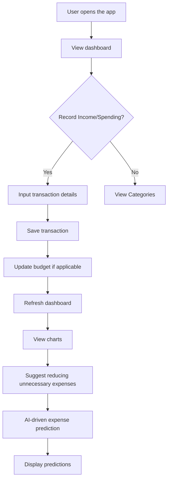
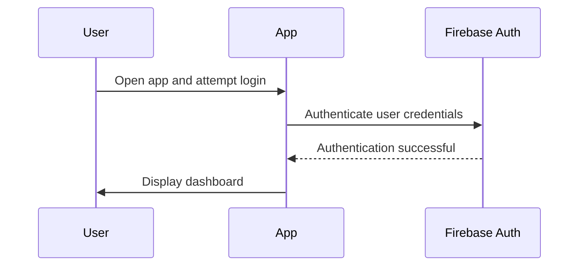
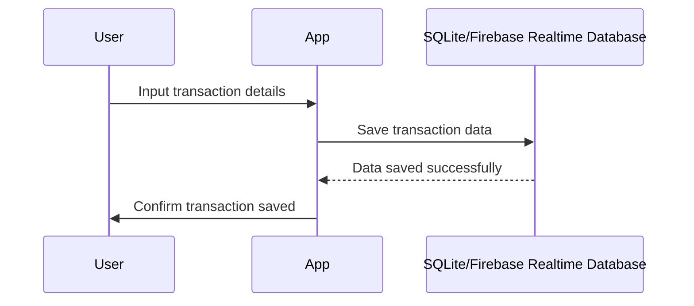
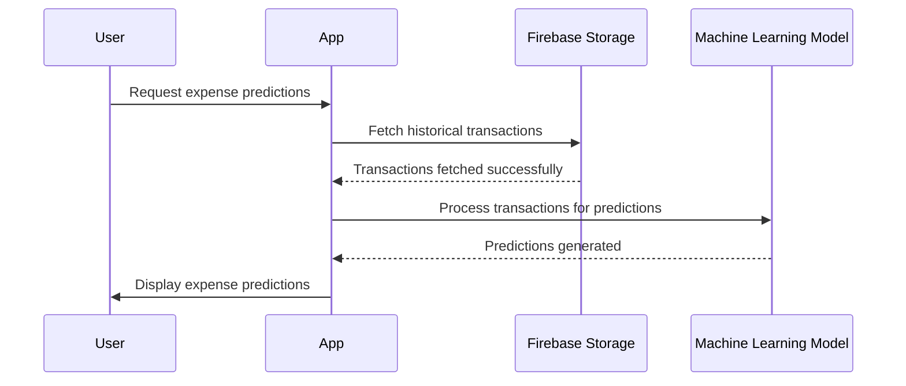

# System Design Document

## 1. System Overview
The Unnamed Project aims to provide a mobile application that helps users manage their personal expenses effectively. The app allows users to record income and spending, categorize transactions, set monthly budgets, view charts showing where money is going, suggest reducing unnecessary expenses, and utilize AI-driven expense prediction.

## 2. Data Flow Diagrams
### Primary User Flow


### Data Processing Pipeline
```mermaid
flowchart TD
    A[User records a transaction] --> B[Transaction data saved locally (SQLite/Firebase Realtime Database)]
    B --> C[Update local budget calculations]
    C --> D[Sync data with cloud storage if online]
    D --> E[AI model processes historical transactions for predictions]
    E --> F[Store AI predictions in cloud storage]
    F --> G[Display predictions to user on dashboard]
```

## 3. Sequence Diagrams
### Authentication


### Core Feature - Record Income/Spending


### Core Feature - AI-driven Expense Prediction


## 4. State Management Strategy
- **Client-side state approach:** Flutter Provider for managing app state across widgets.
- **Server-side state:** Firebase Realtime Database for storing user data and transactions.
- **Real-time state:** Firebase Realtime Database for real-time updates on budget and transaction data.

## 5. Error Handling Patterns
| Error Type | Strategy | User Experience |
|-----------|----------|----------------|
| Network errors | Show error message, retry button | Inform user of network issue and provide option to retry. |
| Validation errors | Highlight invalid fields, show error messages | Guide user through correct input with clear error messages. |
| Server errors | Show generic error message, retry button | Inform user of server issue and provide option to retry. |
| Auth errors | Redirect to login screen, show error message | Prompt user to log in again and display error message if credentials are incorrect. |

## 6. Caching Strategy
| Cache Layer | Technology | TTL | Invalidation Strategy |
|------------|-----------|-----|----------------------|
| Local data (transactions) | SQLite | 24 hours | Invalidate on app restart or data refresh. |
| AI predictions | Firebase Storage | 1 hour | Invalidate on new transaction input or model update. |

## 7. Logging & Monitoring
- **Log levels and what each captures:**
  - `INFO`: User actions, successful operations.
  - `WARNING`: Potential issues that do not affect functionality but need attention.
  - `ERROR`: Critical failures that prevent the app from functioning correctly.

- **Monitoring metrics (latency, error rate, throughput):**
  - Latency for transaction processing and AI model predictions.
  - Error rate for network and server errors.
  - Throughput of data transactions.

- **Alerting thresholds:**
  - High latency (>500ms) should trigger an alert.
  - Error rate >1% per day should trigger an alert.
  - Throughput below 50 transactions/minute for more than 5 minutes should trigger an alert.

## 8. Environment Configurations
| Variable | Development | Staging | Production |
|----------|------------|---------|-----------|
| API_KEY | dev_api_key | stage_api_key | prod_api_key |
| DATABASE_URL | dev_db_url | stage_db_url | prod_db_url |

## 9. CI/CD Pipeline
```mermaid
flowchart LR
    A[Code commit to repository] --> B[Automated tests run]
    B --> C{Tests pass?}
    C -- Yes --> D[Build app]
    C -- No --> E[Fix issues and re-run tests]
    D --> F[Push build to staging environment]
    F --> G[Manual review by QA team]
    G --> H{QA passes?}
    H -- Yes --> I[Deploy to production]
    H -- No --> J[Fix issues in staging, re-push to staging]