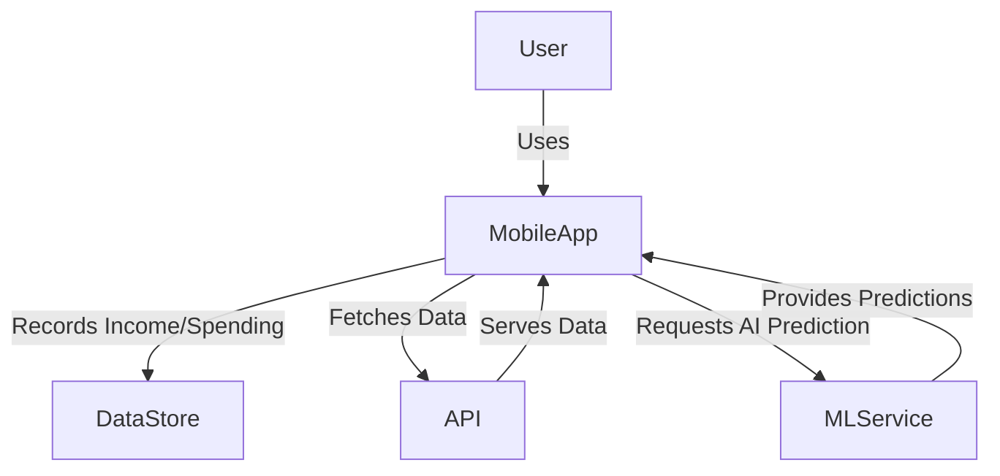
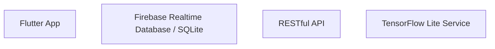
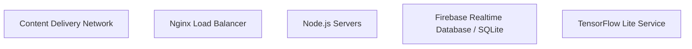

# Technical Architecture Document

## 1. Architecture Overview
The chosen architecture pattern is a **Client-Server** model with a **Microservices** approach. The mobile application will be developed using Flutter, which allows for cross-platform development. Data storage will be handled by SQLite for local data and Firebase Realtime Database for cloud-based data synchronization. For data visualization, Chart.js or Fl_chart will be used, while TensorFlow Lite will provide the AI-driven expense prediction functionality.

### System Context Diagram (C4 Level 1)


### Container Diagram (C4 Level 2)


## 2. Tech Stack

| Layer | Technology | Version | Rationale |
|-------|-----------|---------|-----------|
| Frontend | Flutter | 3.x | Cross-platform mobile app development with a rich UI experience |
| Backend | Node.js | 14.x | Server-side logic and API endpoints |
| Database | Firebase Realtime Database / SQLite | N/A | Cloud-based and local data storage for user transactions and budgets |
| Hosting | Firebase Hosting | N/A | Static file hosting for the mobile app |
| AI Prediction | TensorFlow Lite | N/A | Mobile-friendly machine learning predictions |

### Architecture Decision Records (ADRs)

1. **Decision:** Choose Flutter for mobile app development
   - **Context:** The need to support multiple platforms with a single codebase.
   - **Options Considered:** React Native, Xamarin, and native development.
   - **Rationale:** Flutter offers a rich UI experience, fast development cycle, and strong community support.

2. **Decision:** Use Firebase Realtime Database for cloud storage
   - **Context:** The need for real-time data synchronization across devices.
   - **Options Considered:** Firestore, AWS DynamoDB, and Azure Cosmos DB.
   - **Rationale:** Firebase provides a simple and scalable solution for real-time data synchronization.

3. **Decision:** Use TensorFlow Lite for AI predictions
   - **Context:** The need for mobile-friendly machine learning predictions.
   - **Options Considered:** TensorFlow.js, Core ML, and ONNX Runtime.
   - **Rationale:** TensorFlow Lite is optimized for mobile devices and provides a straightforward way to integrate machine learning models into the app.

## 3. Database Schema

### ER Diagram
```mermaid
erDiagram
    USER ||--o{ EXPENSE : makes
    USER ||--o{ BUDGET : sets
    EXPENSE }|---o{ CATEGORY : belongs_to
    BUDGET }|---o{ CATEGORY : includes
```

### Table Definitions

| Column | Type | Constraints | Description |
|--------|------|------------|-------------|
| user_id | string | PK, unique | Unique identifier for each user |
| username | string | not null | Username of the user |
| email | string | not null, unique | Email address of the user |
| password_hash | string | not null | Hashed password of the user |
| expenses | array | - | Array of expense records |
| budgets | array | - | Array of budget records |

## 4. API Design

### POST /api/expense
- **Description:** Record a new expense for a user.
- **Auth Required:** Yes
- **Request Body:**
    ```json
    {
        "user_id": "string",
        "amount": number,
        "category": string,
        "date": date
    }
    ```
- **Response:**
    ```json
    {
        "status": "success",
        "message": "Expense recorded successfully"
    }
    ```
- **Error Codes:** 401 (Unauthorized), 400 (Bad Request)

### GET /api/expense/user_id
- **Description:** Fetch all expenses for a user.
- **Auth Required:** Yes
- **Response:**
    ```json
    {
        "status": "success",
        "expenses": [
            {
                "amount": number,
                "category": string,
                "date": date
            }
        ]
    }
    ```
- **Error Codes:** 401 (Unauthorized), 404 (Not Found)

### POST /api/budget
- **Description:** Set a new budget for a user.
- **Auth Required:** Yes
- **Request Body:**
    ```json
    {
        "user_id": "string",
        "amount": number,
        "category": string,
        "date": date
    }
    ```
- **Response:**
    ```json
    {
        "status": "success",
        "message": "Budget set successfully"
    }
    ```
- **Error Codes:** 401 (Unauthorized), 400 (Bad Request)

### GET /api/budget/user_id
- **Description:** Fetch all budgets for a user.
- **Auth Required:** Yes
- **Response:**
    ```json
    {
        "status": "success",
        "budgets": [
            {
                "amount": number,
                "category": string,
                "date": date
            }
        ]
    }
    ```
- **Error Codes:** 401 (Unauthorized), 404 (Not Found)

## 5. Authentication & Authorization

- **Auth Strategy:** JWT (JSON Web Tokens)
- **Role Definitions:** User
- **Permission Model:** All users have access to their own data.
- **Token Lifecycle:** Tokens are issued upon successful authentication and expire after a set period.

## 6. Deployment Architecture


## 7. Security Considerations

| Threat | Category | Mitigation |
|--------|---------|------------|
| Data Breach | Confidentiality | Use HTTPS for all data transmission, encrypt sensitive data at rest and in transit. |
| Unauthorized Access | Integrity | Implement JWT authentication with a short-lived token expiration time. |
| Denial of Service (DoS) | Availability | Use a load balancer to distribute traffic across multiple servers and implement rate limiting. |

## 8. Scalability & Performance

- **Expected Load:** Up to 1,000 concurrent users.
- **Bottleneck Analysis:** The primary bottleneck will be the database read/write operations.
- **Scaling Strategy:** Horizontal scaling (adding more servers) for load balancing and vertical scaling (upgrading server resources) for performance optimization.
- **Caching Strategy:** Use Redis for caching frequently accessed data.
- **CDN Usage:** Deploy a CDN to serve static assets and reduce latency for users globally.