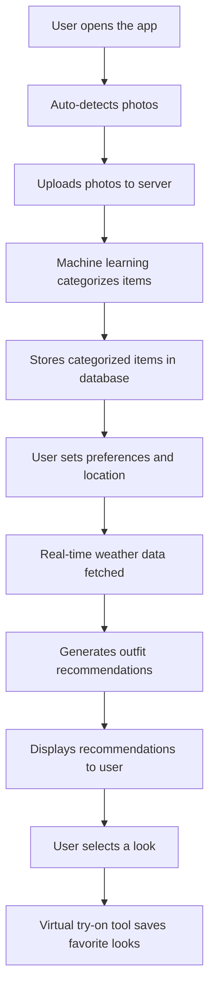
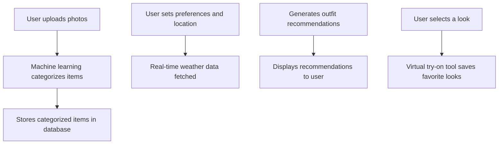
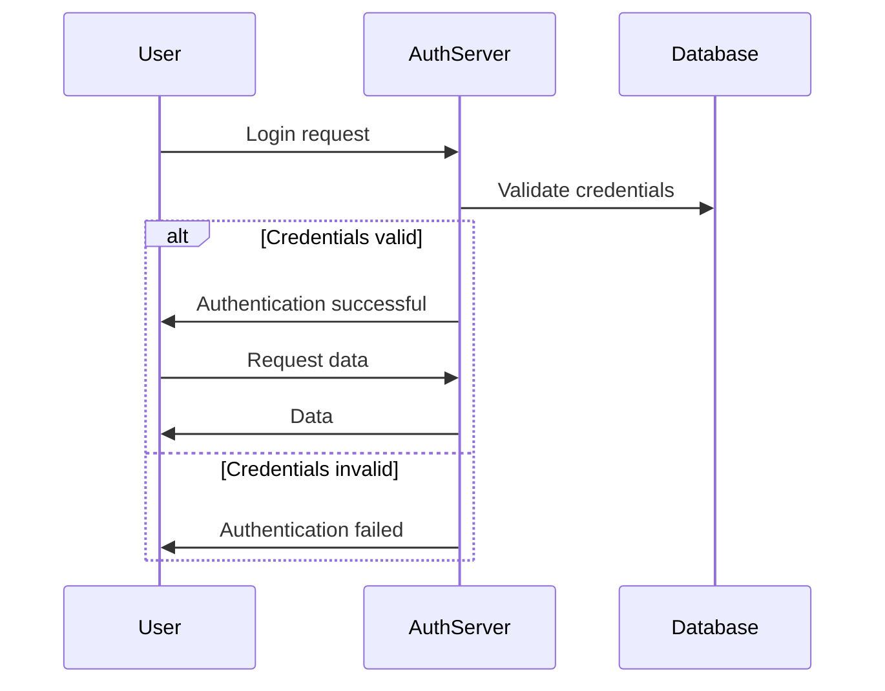
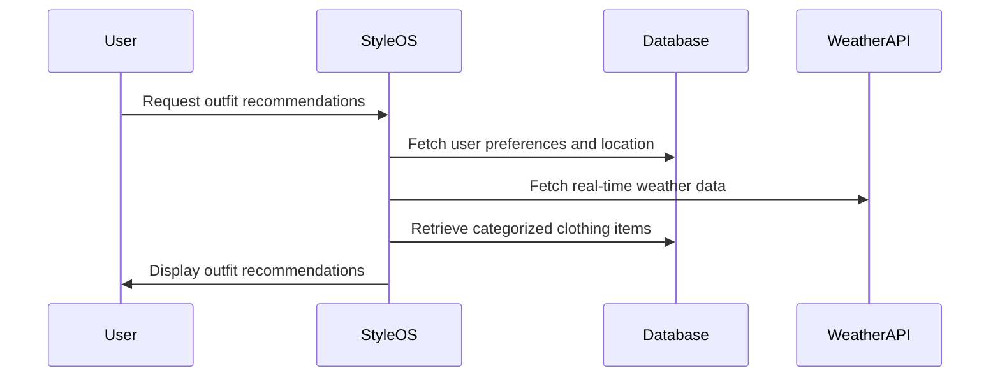
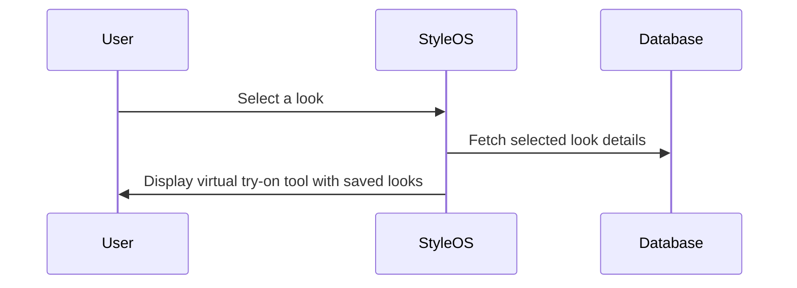
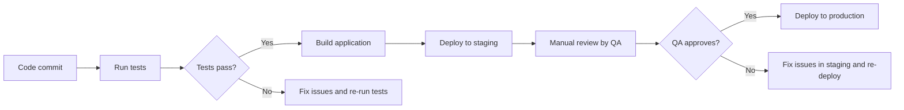

# System Design Document

## 1. System Overview
Style OS is an AI-powered digital closet platform that uses machine learning algorithms to provide personalized styling solutions based on user preferences and local weather. The system includes features such as auto-detecting photo capture for categorizing clothing items, real-time outfit recommendations, and a virtual try-on tool.

## 2. Data Flow Diagrams

### Primary User Flow

### Data Processing Pipeline

## 3. Sequence Diagrams

### Authentication

### Core Feature - Outfit Recommendations

### Virtual Try-On Tool

## 4. State Management Strategy
- **Client-side state:** React Context for managing user preferences and outfit recommendations.
- **Server-side state:** Sessions to maintain user authentication state.
- **Real-time state:** WebSockets for real-time data processing.

## 5. Error Handling Patterns

| Error Type | Strategy | User Experience |
|-----------|----------|----------------|
| Network errors | Show error message and retry functionality | Inform the user of network issues and provide a retry option. |
| Validation errors | Highlight invalid fields and show error messages | Clearly indicate which fields are incorrect and provide guidance on how to correct them. |
| Server errors | Log error details and display generic error message | Log server-side errors for debugging and display a user-friendly error message. |
| Auth errors | Redirect to login page with error message | Inform the user of authentication issues and redirect them to the login screen. |

## 6. Caching Strategy

| Cache Layer | Technology | TTL | Invalidation Strategy |
|------------|-----------|-----|----------------------|
| User Preferences | Redis | 1 hour | Invalidate on user preference change or session expiration |
| Outfit Recommendations | Redis | 30 minutes | Invalidate on user preference change, location update, weather change, or new recommendations |

## 7. Logging & Monitoring

- **Log levels:** DEBUG, INFO, WARNING, ERROR, CRITICAL
  - DEBUG: Detailed information for diagnosing problems.
  - INFO: Confirmation that things are working as expected.
  - WARNING: An indication that something unexpected happened, or indicative of some problem in the near future (e.g., 'disk space low'). The software is still working as expected.
  - ERROR: Due to a more serious problem, the software has not been able to perform some function.
  - CRITICAL: A serious error, indicating that the program itself may be unable to continue running.

- **Monitoring metrics:** Latency, error rate, throughput
  - Latency: Time taken for requests to complete.
  - Error rate: Percentage of failed requests.
  - Throughput: Number of requests processed per unit time.

- **Alerting thresholds:** Set up alerts for high error rates and excessive latency to notify the team immediately.

## 8. Environment Configurations

| Variable | Development | Staging | Production |
|----------|------------|---------|-----------|
| API_KEY | dev_api_key | stage_api_key | prod_api_key |
| DB_HOST | localhost | staging-db.example.com | prod-db.example.com |
| DB_PORT | 5432 | 5432 | 5432 |
| REDIS_URL | redis://localhost:6379 | redis://staging-redis.example.com:6379 | redis://prod-redis.example.com:6379 |

## 9. CI/CD Pipeline

This document provides a comprehensive overview of the system design for Style OS, including data flows, sequence diagrams, state management strategies, error handling patterns, caching, logging, monitoring, environment configurations, and the CI/CD pipeline.