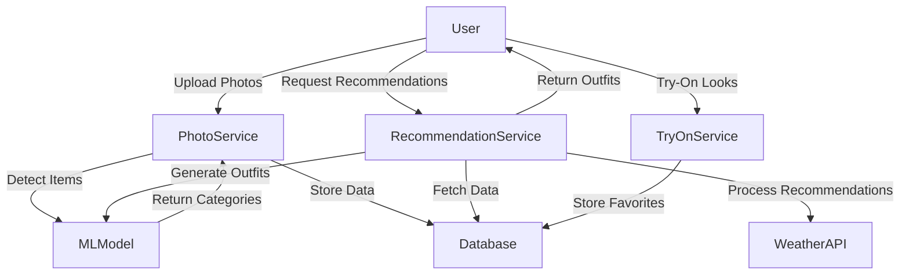
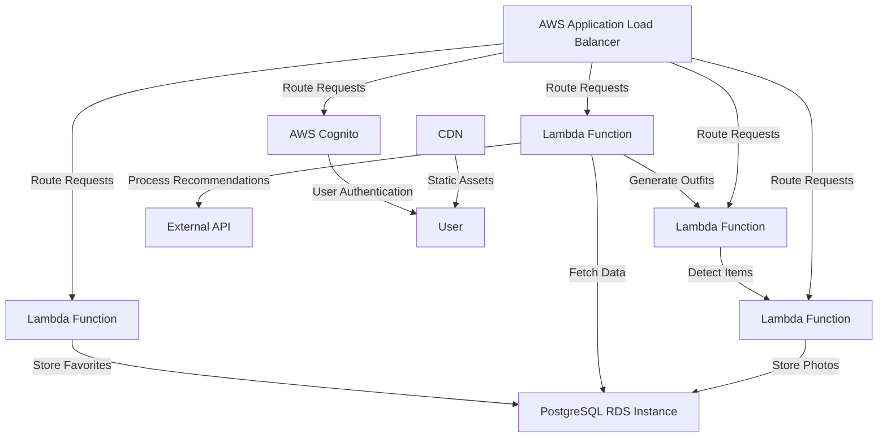

# Technical Architecture Document

## 1. Architecture Overview
The overall architecture pattern chosen is a **Microservices-based** architecture with a focus on **Serverless computing** and **Event-driven processing**. This approach allows for scalability, fault isolation, and easier maintenance of individual components.

### System Context Diagram (C4 Level 1)


### Container Diagram (C4 Level 2)


## 2. Tech Stack
| Layer | Technology | Version | Rationale |
|-------|-----------|---------|-----------|
| Frontend | Flutter | 3.0+ | Cross-platform app development with a rich UI experience |
| Backend | Node.js | 16.x | Serverless functions and event-driven architecture |
| Database | PostgreSQL | 13.x | Relational database for storing user data and photos |
| Machine Learning | TensorFlow.js | 2.x | For image recognition and styling suggestions |
| WebSockets | Socket.IO | 4.x | Real-time communication between client and server |
| Hosting | AWS Lambda | N/A | Serverless compute for backend services |
| API Gateway | AWS API Gateway | N/A | Manages incoming requests and routes them to appropriate services |
| EventBridge | AWS EventBridge | N/A | For event-driven processing and orchestration |

### Architecture Decision Records (ADRs)
1. **Decision:** Use Flutter for the frontend
   - **Context:** The target audience includes users with busy lifestyles, requiring a seamless and intuitive user experience.
   - **Options Considered:** React Native, Vue.js, Xamarin
   - **Rationale:** Flutter provides a single codebase that can be compiled to native apps for multiple platforms (iOS, Android), offering a consistent user experience across devices.

2. **Decision:** Use Node.js with AWS Lambda for backend services
   - **Context:** The architecture needs to be scalable and serverless.
   - **Options Considered:** Python, Java, Go
   - **Rationale:** Node.js is well-suited for building serverless applications due to its asynchronous nature and extensive ecosystem of libraries.

3. **Decision:** Use PostgreSQL for the database
   - **Context:** The application requires a relational database for storing user data and photos.
   - **Options Considered:** MongoDB, MySQL, DynamoDB
   - **Rationale:** PostgreSQL provides robust transactional capabilities and is well-suited for complex queries and data relationships.

4. **Decision:** Use TensorFlow.js for machine learning
   - **Context:** The application needs to perform image recognition and styling suggestions.
   - **Options Considered:** PyTorch, Caffe, Keras
   - **Rationale:** TensorFlow.js allows running machine learning models directly in the browser or on a server, making it ideal for real-time processing.

5. **Decision:** Use Socket.IO for real-time communication
   - **Context:** The application needs to provide real-time outfit recommendations and try-on functionality.
   - **Options Considered:** WebSocket, SignalR, Firebase Realtime Database
   - **Rationale:** Socket.IO provides a simple API for real-time bidirectional event-based communication between clients and servers.

## 3. Database Schema
### ER Diagram
```mermaid
erDiagram
    USER ||--o{ PHOTOS : contains
    PHOTOS }||--o{ CATEGORIES : categorized_as
    USER ||--o{ OUTFITS : recommends
    OUTFITS }||--o{ LOOKS : consists_of
    LOOKS }||--o{ FAVORITES : saved_in
```

### Table Definitions
| Column | Type | Constraints | Description |
|--------|------|------------|-------------|
| user_id | UUID | PRIMARY KEY, NOT NULL | Unique identifier for each user |
| username | VARCHAR(255) | UNIQUE, NOT NULL | Username of the user |
| email | VARCHAR(255) | UNIQUE, NOT NULL | Email address of the user |
| password_hash | VARCHAR(255) | NOT NULL | Hashed password of the user |
| created_at | TIMESTAMP | DEFAULT CURRENT_TIMESTAMP, NOT NULL | Timestamp when the user was created |

| Column | Type | Constraints | Description |
|--------|------|------------|-------------|
| photo_id | UUID | PRIMARY KEY, NOT NULL | Unique identifier for each photo |
| user_id | UUID | FOREIGN KEY REFERENCES USER(user_id), NOT NULL | User who uploaded the photo |
| image_data | BYTEA | NOT NULL | Binary data of the photo |
| created_at | TIMESTAMP | DEFAULT CURRENT_TIMESTAMP, NOT NULL | Timestamp when the photo was uploaded |

| Column | Type | Constraints | Description |
|--------|------|------------|-------------|
| category_id | UUID | PRIMARY KEY, NOT NULL | Unique identifier for each category |
| photo_id | UUID | FOREIGN KEY REFERENCES PHOTOS(photo_id), NOT NULL | Photo that belongs to this category |
| category_name | VARCHAR(255) | NOT NULL | Name of the category |

| Column | Type | Constraints | Description |
|--------|------|------------|-------------|
| outfit_id | UUID | PRIMARY KEY, NOT NULL | Unique identifier for each outfit |
| user_id | UUID | FOREIGN KEY REFERENCES USER(user_id), NOT NULL | User who recommended this outfit |
| created_at | TIMESTAMP | DEFAULT CURRENT_TIMESTAMP, NOT NULL | Timestamp when the outfit was recommended |

| Column | Type | Constraints | Description |
|--------|------|------------|-------------|
| look_id | UUID | PRIMARY KEY, NOT NULL | Unique identifier for each look |
| outfit_id | UUID | FOREIGN KEY REFERENCES OUTFITS(outfit_id), NOT NULL | Outfit that consists of this look |
| photo_id | UUID | FOREIGN KEY REFERENCES PHOTOS(photo_id), NOT NULL | Photo that belongs to this look |

| Column | Type | Constraints | Description |
|--------|------|------------|-------------|
| favorite_id | UUID | PRIMARY KEY, NOT NULL | Unique identifier for each favorite |
| user_id | UUID | FOREIGN KEY REFERENCES USER(user_id), NOT NULL | User who saved this favorite |
| look_id | UUID | FOREIGN KEY REFERENCES LOOKS(look_id), NOT NULL | Look that was saved as a favorite |

## 4. API Design
### POST /api/photos/upload
- **Description:** Uploads a photo and categorizes it.
- **Auth Required:** Yes
- **Request Body:**
    ```json
    {
        "image_data": "base64_encoded_image"
    }
    ```
- **Response:**
    ```json
    {
        "photo_id": "unique_photo_id",
        "category_ids": ["category1", "category2"]
    }
    ```
- **Error Codes:** 400 (Invalid request), 401 (Unauthorized)

### GET /api/outfits/recommendations
- **Description:** Generates outfit recommendations based on user preferences and weather.
- **Auth Required:** Yes
- **Request Body:**
    ```json
    {
        "user_id": "unique_user_id",
        "weather_data": {
            "temperature": 25,
            "condition": "sunny"
        }
    }
    ```
- **Response:**
    ```json
    {
        "outfit_id": "unique_outfit_id",
        "looks": [
            {
                "look_id": "unique_look_id",
                "photo_ids": ["photo1", "photo2"]
            }
        ]
    }
    ```
- **Error Codes:** 400 (Invalid request), 401 (Unauthorized)

### POST /api/looks/save
- **Description:** Saves a look as a favorite.
- **Auth Required:** Yes
- **Request Body:**
    ```json
    {
        "user_id": "unique_user_id",
        "look_id": "unique_look_id"
    }
    ```
- **Response:**
    ```json
    {
        "message": "Look saved as favorite"
    }
    ```
- **Error Codes:** 400 (Invalid request), 401 (Unauthorized)

## 5. Authentication & Authorization
- Auth strategy: JWT (JSON Web Tokens)
- Role definitions: User, Admin
- Permission model: CRUD operations on user data and photos
- Token lifecycle: Issued upon successful login, expires after 2 hours

## 6. Deployment Architecture


## 7. Security Considerations
Apply STRIDE threat model:
| Threat | Category | Mitigation |
|--------|---------|------------|
| Spoofing | Authentication | Use JWT with a secure secret key and validate tokens on each request |
| Tampering | Data Integrity | Encrypt sensitive data in transit using HTTPS and implement input validation |
| Repudiation | Non-repudiation | Implement digital signatures for transactions and store logs for audit trails |
| Information Disclosure | Confidentiality | Limit access to user data based on roles and permissions, use encryption at rest |
| Denial of Service | Availability | Use load balancers and auto-scaling groups to distribute traffic and handle spikes |
| Elevation of Privilege | Access Control | Implement role-based access control (RBAC) and least privilege principle |

## 8. Scalability & Performance
- Expected load: 10,000 concurrent users, 500 requests/sec
- Bottleneck analysis: Photo processing and database queries are the primary bottlenecks
- Scaling strategy: Horizontal scaling for backend services using AWS Lambda and auto-scaling groups
- Caching strategy: Use Redis for caching frequently accessed data
- CDN usage: Deploy static assets on a CDN to reduce latency and improve load times

This document provides a comprehensive technical architecture for the Unnamed Project, ensuring that all components are well-documented and aligned with the project requirements.