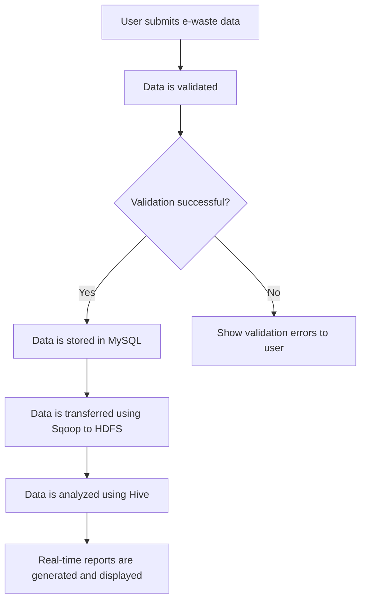
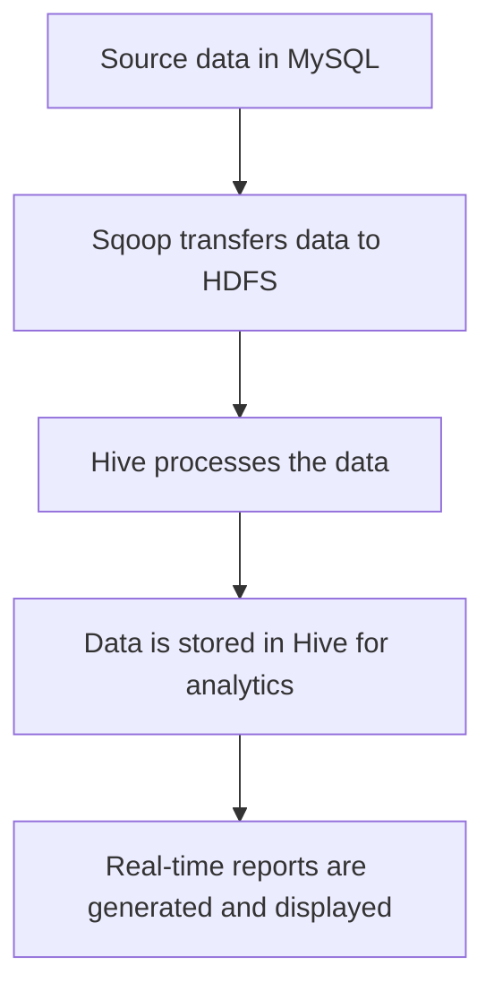
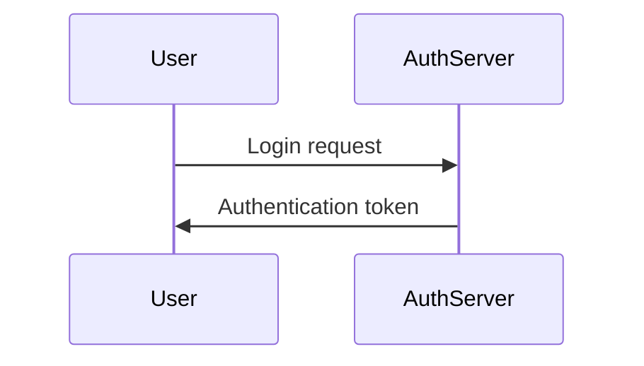
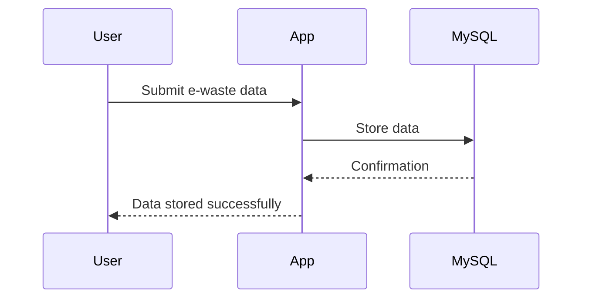
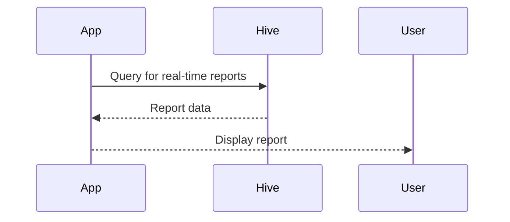
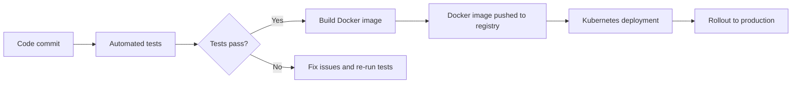

# System Design Document

## 1. System Overview
The system is designed to manage e-waste data in educational institutions and organizations efficiently. It involves collecting, storing, processing, and analyzing large volumes of structured data using MySQL for source data management, Apache Sqoop for transferring data into the Hadoop ecosystem, HDFS for distributed storage, and Apache Hive for analytical querying.

## 2. Data Flow Diagrams
### Primary User Flow

### Data Processing Pipeline

## 3. Sequence Diagrams
### Authentication

### Core Feature (Data Submission)

### Core Feature (Real-time Reporting)

## 4. State Management Strategy
- **Client-side state:** Not applicable as the system is a web application.
- **Server-side state:** Sessions are used to manage user authentication and state across requests.
- **Real-time state:** WebSockets can be used for real-time updates.

## 5. Error Handling Patterns
| Error Type | Strategy | User Experience |
|-----------|----------|----------------|
| Network errors | Show error message with retry option | Inform the user that there was a network issue and provide an option to retry the operation. |
| Validation errors | Highlight invalid fields and show error messages | Display validation errors immediately upon form submission, highlighting the invalid fields. |
| Server errors | Log error details and show generic error message | Log detailed error information for troubleshooting and display a user-friendly error message. |
| Auth errors | Redirect to login page with error message | If authentication fails, redirect the user to the login page and display an error message indicating that their credentials are incorrect. |

## 6. Caching Strategy
| Cache Layer | Technology | TTL | Invalidation Strategy |
|------------|-----------|-----|----------------------|
| User sessions | Redis | 30 minutes | Invalidate on logout or session expiration |
| Data queries | Memcached | 1 hour | Invalidate based on data changes |

## 7. Logging & Monitoring
- **Log levels:** DEBUG, INFO, WARN, ERROR, CRITICAL
  - DEBUG: Detailed information for troubleshooting.
  - INFO: Confirmation of successful operations.
  - WARN: Non-critical issues that may affect performance.
  - ERROR: Runtime errors that prevent normal operation.
  - CRITICAL: Severe errors that require immediate attention.
- **Monitoring metrics:** Latency, error rate, throughput
- **Alerting thresholds:** Set thresholds for high latency and error rates to trigger alerts.

## 8. Environment Configurations
| Variable | Development | Staging | Production |
|----------|------------|---------|-----------|
| DB_HOST | localhost | staging-db.example.com | prod-db.example.com |
| DB_USER | dev_user | stg_user | prod_user |
| DB_PASSWORD | dev_password | stg_password | prod_password |
| HDFS_URL | hdfs://localhost:9000 | hdfs://staging-hadoop.example.com:9000 | hdfs://prod-hadoop.example.com:9000 |

## 9. CI/CD Pipeline

This System Design Document provides a comprehensive overview of the system, including data flows, sequence diagrams, state management strategies, error handling patterns, caching strategy, logging and monitoring, environment configurations, and CI/CD pipeline.