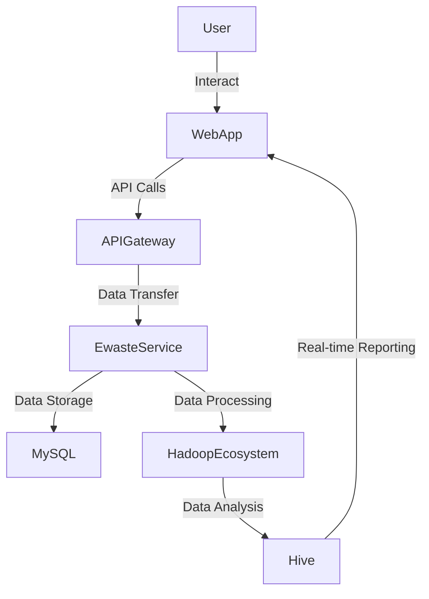
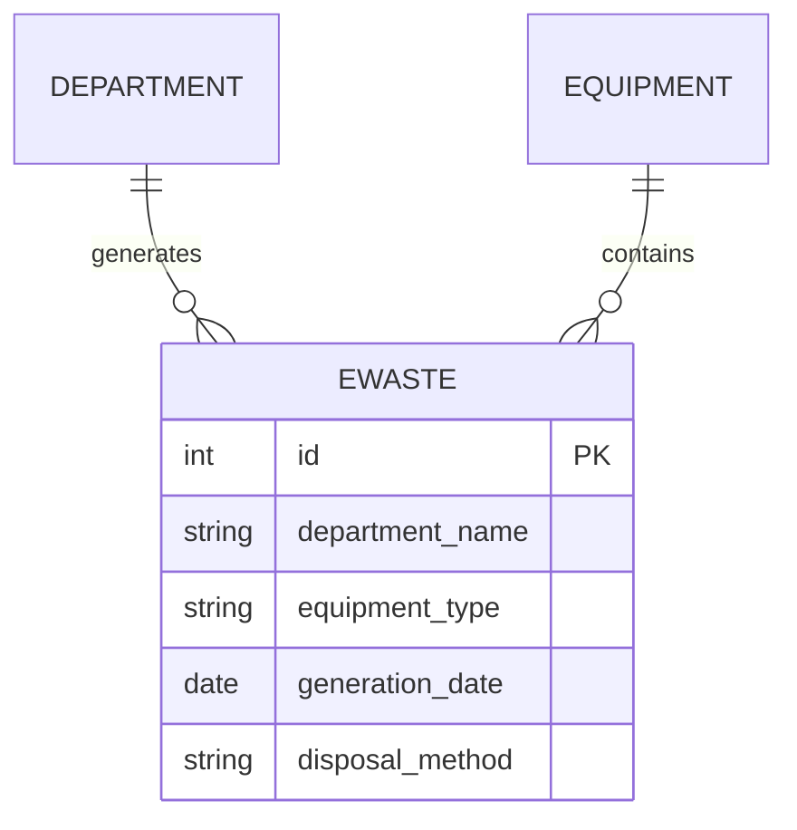
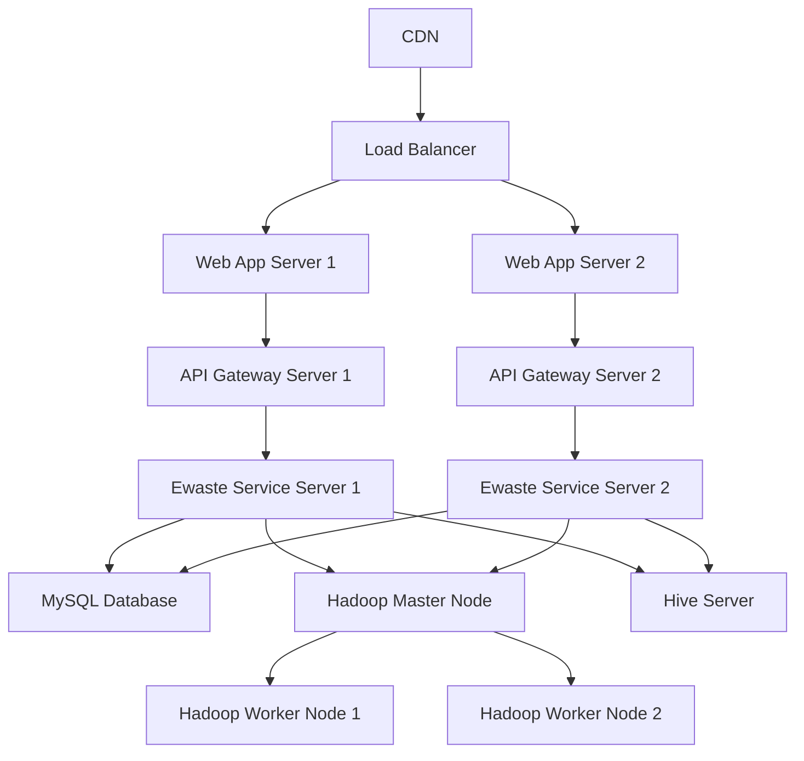

# Technical Architecture Document

## 1. Architecture Overview
The chosen architecture pattern is a **Microservices-based** architecture with a focus on **Big Data** technologies to handle large volumes of structured e-waste data efficiently.

### System Context Diagram (C4 Level 1)


### Container Diagram (C4 Level 2)


## 2. Tech Stack

| Layer | Technology | Version | Rationale |
|-------|-----------|---------|-----------|
| Frontend | React.js | 17.x | Provides a modern, user-friendly interface for interacting with the system. |
| Backend | Spring Boot | 2.5.x | Offers robust support for building microservices and RESTful APIs. |
| Database | MySQL | 8.0.x | Suitable for managing structured data efficiently. |
| Data Processing | Apache Sqoop | 1.4.x | Facilitates efficient data transfer between relational databases and Hadoop. |
| Distributed Storage | HDFS (Hadoop Distributed File System) | 3.2.x | Provides scalable storage for large datasets. |
| Analytics | Apache Hive | 3.1.x | Enables SQL-like querying of big data stored in HDFS. |

### Architecture Decision Records (ADRs)
- **Decision:** Use MySQL for source data management.
  - **Context:** The need for a relational database to manage structured e-waste data efficiently.
  - **Options Considered:** PostgreSQL, MongoDB.
  - **Rationale:** MySQL offers better performance and scalability compared to NoSQL databases for this use case.

- **Decision:** Use Apache Sqoop for transferring data into the Hadoop ecosystem.
  - **Context:** The need to process large volumes of data using Big Data technologies.
  - **Options Considered:** Kafka, Spark Streaming.
  - **Rationale:** Sqoop is specifically designed for efficient data transfer between relational databases and Hadoop.

- **Decision:** Use HDFS for distributed storage.
  - **Context:** The requirement for scalable storage to handle large datasets.
  - **Options Considered:** AWS S3, Google Cloud Storage.
  - **Rationale:** HDFS provides a highly reliable and fault-tolerant storage solution for big data.

- **Decision:** Use Apache Hive for analytical querying.
  - **Context:** The need for real-time analysis and reporting on e-waste data.
  - **Options Considered:** Presto, Impala.
  - **Rationale:** Hive offers a SQL-like interface to query large datasets stored in HDFS efficiently.

## 3. Database Schema

### ER Diagram


### Table Definitions

| Column | Type | Constraints | Description |
|--------|------|------------|-------------|
| id     | INT  | PRIMARY KEY | Unique identifier for each e-waste record. |
| department_name | VARCHAR(255) | NOT NULL | Name of the department that generated the e-waste. |
| equipment_type | VARCHAR(255) | NOT NULL | Type of equipment (e.g., computer, printer). |
| generation_date | DATE | NOT NULL | Date when the e-waste was generated. |
| disposal_method | VARCHAR(255) | NOT NULL | Method used for disposing the e-waste (e.g., recycling, disposal). |

## 4. API Design

### POST /ewaste
- **Description:** Adds a new e-waste record.
- **Auth Required:** Yes
- **Request Body:**
    ```json
    {
        "department_name": "IT",
        "equipment_type": "Computer",
        "generation_date": "2023-10-01",
        "disposal_method": "Recycling"
    }
    ```
- **Response:** 201 Created
    ```json
    {
        "id": 1,
        "department_name": "IT",
        "equipment_type": "Computer",
        "generation_date": "2023-10-01",
        "disposal_method": "Recycling"
    }
    ```
- **Error Codes:** 400 Bad Request, 401 Unauthorized

### GET /ewaste
- **Description:** Retrieves all e-waste records.
- **Auth Required:** Yes
- **Response:** 200 OK
    ```json
    [
        {
            "id": 1,
            "department_name": "IT",
            "equipment_type": "Computer",
            "generation_date": "2023-10-01",
            "disposal_method": "Recycling"
        }
    ]
    ```
- **Error Codes:** 401 Unauthorized

### GET /ewaste/department/{departmentName}
- **Description:** Retrieves e-waste records for a specific department.
- **Auth Required:** Yes
- **Response:** 200 OK
    ```json
    [
        {
            "id": 1,
            "department_name": "IT",
            "equipment_type": "Computer",
            "generation_date": "2023-10-01",
            "disposal_method": "Recycling"
        }
    ]
    ```
- **Error Codes:** 401 Unauthorized, 404 Not Found

## 5. Authentication & Authorization
- **Auth Strategy:** JWT (JSON Web Tokens)
  - **Token Lifecycle:** Issued upon user login and valid for 24 hours.
- **Role Definitions:**
  - Admin: Can manage users and view all data.
  - User: Can only view their department's data.
- **Permission Model:** Role-based access control (RBAC).

## 6. Deployment Architecture


## 7. Security Considerations

| Threat | Category | Mitigation |
|--------|---------|------------|
| Data Breach | Confidentiality | Use SSL/TLS for all data transmissions. Regularly update and patch MySQL, Hadoop, and other components. |
| SQL Injection | Integrity | Validate and sanitize all user inputs. Use parameterized queries in MySQL. |
| Denial of Service (DoS) | Availability | Implement rate limiting on API endpoints. Use a load balancer to distribute traffic evenly. |
| Cross-Site Scripting (XSS) | Integrity | Sanitize all user inputs before rendering them in the UI. Use Content Security Policy (CSP). |

## 8. Scalability & Performance
- **Expected Load:** Up to 10,000 concurrent users.
- **Bottleneck Analysis:** MySQL for data storage and Hadoop for processing.
- **Scaling Strategy:** Horizontal scaling using multiple instances of WebApp Servers, API Gateway Servers, Ewaste Service Servers, Hadoop Worker Nodes.
- **Caching Strategy:** Use Redis for caching frequently accessed data.
- **CDN Usage:** Deploy a CDN to reduce latency and improve performance.

This document provides a comprehensive technical architecture for managing e-waste data in educational institutions and organizations using Big Data technologies.