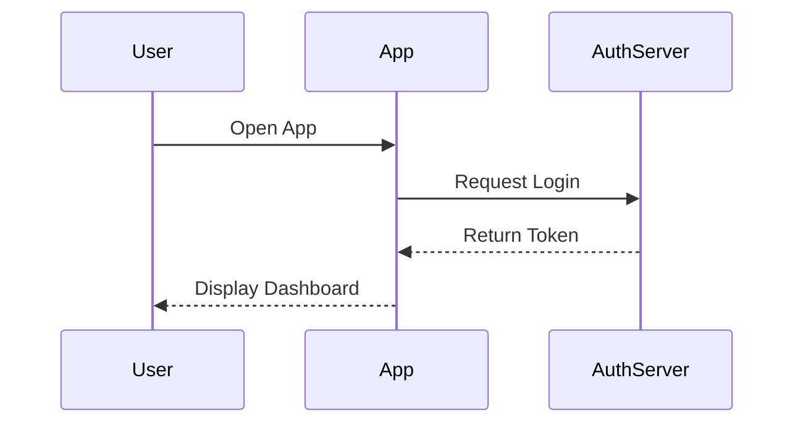
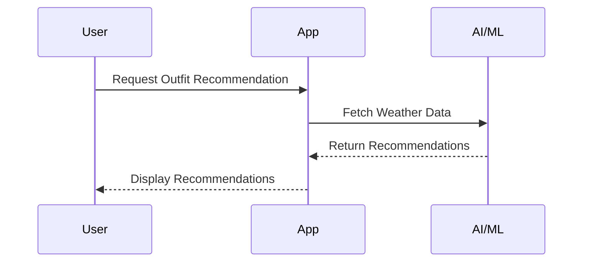
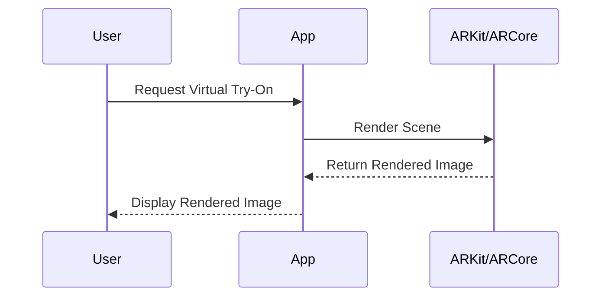
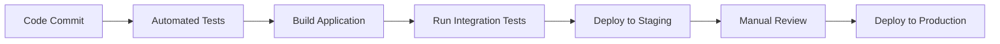

# System Design Document

## 1. System Overview
The 'Style OS' application is an AI-powered digital closet and smart stylist application designed to provide users with a premium, space-themed dark mode aesthetic. It includes features such as a centralized dashboard displaying local weather, a Style Score ring chart, and AI outfit recommendations. The application also features a filterable digital wardrobe grid with quick-add camera buttons, an interactive virtual try-on screen, and a Closet Health analytics hub.

## 2. Data Flow Diagrams
### Primary User Flow
```mermaid
flowchart TD
    A[User opens the app] --> B[Home Screen]
    B --> C[Dashboard (Weather, Style Score, Outfit Recommendation)]
    C --> D[Wardrobe Grid]
    D --> E[Quick-Add Camera Button]
    E --> F[Virtual Try-On Screen]
    F --> G[Closet Health Analytics Hub]
```

### Data Processing Pipeline
```mermaid
flowchart TD
    A[User input (e.g., camera capture)] --> B[Camera API]
    B --> C[Image Processing]
    C --> D[AI/ML Library for Outfit Recommendations]
    D --> E[Outfit Recommendation Stored in Database]
    E --> F[Display Recommendation on Dashboard]
```

## 3. Sequence Diagrams
### Authentication Flow


### Outfit Recommendation Flow


### Virtual Try-On Flow


## 4. State Management Strategy
- **Client-side state approach:** Redux for managing the application's state, including user preferences, wardrobe items, and outfit recommendations.
- **Server-side state:** PostgreSQL for storing user data, wardrobe items, and analytics.

## 5. Error Handling Patterns
| Error Type | Strategy | User Experience |
|-----------|----------|----------------|
| Network errors | Show error message with retry option | Inform the user that there was a network issue and provide an option to retry the operation. |
| Validation errors | Display error messages next to input fields | Highlight invalid inputs and display error messages directly on the form. |
| Server errors | Log error and show generic error message | Log the error for debugging purposes and inform the user of a server-side issue without revealing specific details. |
| Auth errors | Redirect to login page with error message | Inform the user that their session has expired or they are not authorized, and redirect them to the login page. |

## 6. Caching Strategy
| Cache Layer | Technology | TTL | Invalidation Strategy |
|------------|-----------|-----|----------------------|
| User Preferences | LocalStorage | 1 day | Invalidate on logout or preference change |
| Wardrobe Items | Redis | 24 hours | Invalidate on item addition, deletion, or update |
| Outfit Recommendations | Redis | 30 minutes | Invalidate on weather change or user preferences |

## 7. Logging & Monitoring
- **Log levels:** Debug, Info, Warning, Error, Critical
- **Monitoring metrics:** Latency, error rate, throughput
- **Alerting thresholds:** Set up alerts for high error rates and low throughput to ensure the system remains responsive.

## 8. Environment Configurations
| Variable | Development | Staging | Production |
|----------|------------|---------|-----------|
| API_KEY | dev_api_key | stage_api_key | prod_api_key |
| DB_HOST | localhost | staging-db.example.com | production-db.example.com |
| DB_PORT | 5432 | 5432 | 5432 |

## 9. CI/CD Pipeline


**Decisions Made:**
- **UI Framework:** React for the UI components.
- **State Management:** Redux for state management.
- **Real-time Updates:** WebSockets for real-time updates.
- **AI/ML Library:** AI/ML library for outfit recommendations.
- **Camera API:** Camera API for quick-add functionality.
- **ARKit/ARCore:** ARKit or ARCore for virtual try-on.
- **Database:** PostgreSQL for wardrobe and analytics data storage.

These decisions ensure that the 'Style OS' application is built with a modern, scalable, and user-friendly interface.