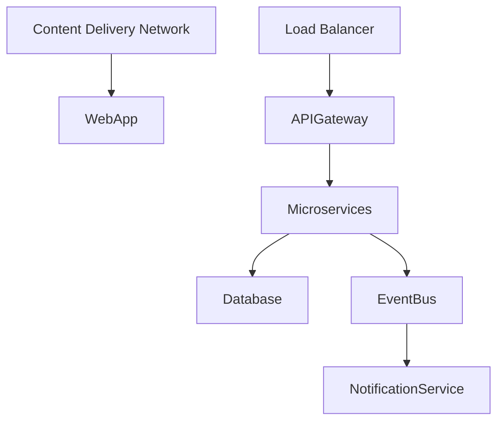

# Technical Architecture Document

## 1. Architecture Overview
The overall architecture pattern chosen is a **Microservices-based** architecture with a focus on **Serverless Functions** and **Event-Driven** processing. This approach allows for scalability, flexibility, and easier maintenance of the system.

### System Context Diagram (C4 Level 1)
```mermaid
graph TD
    User -->|Interact with| WebApp
    WebApp -->|API Calls| API Gateway
    APIGateway -->|Process Requests| Microservices
    Microservices -->|Database Operations| Database
    Microservices -->|Real-Time Updates| Event Bus
    EventBus -->|Notify Subscribers| Notification Service
```

### Container Diagram (C4 Level 2)
```mermaid
graph TD
    WebApp[Web Application] --> APIGateway[API Gateway]
    APIGateway --> WeatherService[Weather Service]
    APIGateway --> StyleScoreService[Style Score Service]
    APIGateway --> OutfitRecommendationService[Outfit Recommendation Service]
    APIGateway --> WardrobeService[Wardrobe Service]
    APIGateway --> ClosetHealthService[Closet Health Service]
    APIGateway --> VirtualTryOnService[Virtual Try-On Service]
    WeatherService --> Database
    StyleScoreService --> Database
    OutfitRecommendationService --> AI/ML Library
    WardrobeService --> Database
    ClosetHealthService --> Database
    VirtualTryOnService --> CameraAPI
    VirtualTryOnService --> ARKit/ARCore
```

## 2. Tech Stack
| Layer | Technology | Version | Rationale |
|-------|-----------|---------|-----------|
| Frontend | React | 17.x | Modern, declarative UI framework for building complex applications. |
| State Management | Redux | 4.x | Predictable state container for JavaScript apps. |
| API Gateway | AWS API Gateway | N/A | Manages and routes requests to microservices. |
| Microservices | Node.js with Express | N/A | Scalable, serverless architecture using event-driven processing. |
| Database | PostgreSQL | 13.x | Relational database for structured data storage. |
| AI/ML Library | TensorFlow.js | N/A | JavaScript library for machine learning and deep learning. |
| Camera API | WebRTC | N/A | Access to camera and microphone for quick-add functionality. |
| ARKit/ARCore | N/A | Cross-platform framework for augmented reality experiences. |
| Hosting | AWS Lambda | N/A | Serverless compute service. |
| Event Bus | AWS EventBridge | N/A | Decentralized event bus for microservices communication. |
| Notification Service | AWS SNS | N/A | Publish/subscribe messaging system for real-time updates. |

### Architecture Decision Records (ADRs)
1. **Decision:** Use React for the UI components.
   - **Context:** The project requires a modern, declarative UI framework with strong community support and extensive documentation.
   - **Options Considered:** Vue.js, Angular, Svelte.
   - **Rationale:** React offers a large ecosystem of libraries and tools, making it easier to build complex applications.

2. **Decision:** Use Redux for state management.
   - **Context:** The application requires a predictable state container to manage global state across components.
   - **Options Considered:** MobX, Vuex, Context API.
   - **Rationale:** Redux provides a centralized store with well-defined actions and reducers, making it easier to reason about the state of the application.

3. **Decision:** Use AWS API Gateway for API management.
   - **Context:** The project requires a scalable, serverless API gateway to route requests to microservices.
   - **Options Considered:** Azure API Management, Google Cloud Endpoints.
   - **Rationale:** AWS API Gateway offers comprehensive features for managing APIs, including rate limiting, caching, and authentication.

4. **Decision:** Use Node.js with Express for microservices.
   - **Context:** The project requires a scalable, serverless architecture using event-driven processing.
   - **Options Considered:** Python Flask, Java Spring Boot.
   - **Rationale:** Node.js with Express provides a lightweight, flexible framework for building microservices that can scale easily.

5. **Decision:** Use PostgreSQL for the database.
   - **Context:** The project requires a relational database for structured data storage.
   - **Options Considered:** MongoDB, MySQL.
   - **Rationale:** PostgreSQL offers ACID transactions, robust querying capabilities, and extensive support for complex data models.

## 3. Database Schema
### ER Diagram
```mermaid
erDiagram
    User ||--o{ Wardrobe : owns
    Wardrobe }|--|| Item : contains
    Wardrobe }|---o{ ClosetHealth : tracks
    OutfitRecommendation ||--o{ Weather : considers
```

### Table Definitions
| Column | Type | Constraints | Description |
|--------|------|------------|-------------|
| user_id | UUID | PRIMARY KEY, NOT NULL | Unique identifier for each user. |
| username | VARCHAR(255) | UNIQUE, NOT NULL | Username of the user. |
| email | VARCHAR(255) | UNIQUE, NOT NULL | Email address of the user. |
| password_hash | VARCHAR(255) | NOT NULL | Hashed password for authentication. |
| created_at | TIMESTAMP | DEFAULT CURRENT_TIMESTAMP | Timestamp when the user was created. |

| Column | Type | Constraints | Description |
|--------|------|------------|-------------|
| wardrobe_id | UUID | PRIMARY KEY, NOT NULL | Unique identifier for each wardrobe. |
| user_id | UUID | FOREIGN KEY REFERENCES User(user_id), NOT NULL | Foreign key linking to the user who owns the wardrobe. |
| item_id | UUID | UNIQUE, NOT NULL | Unique identifier for each item in the wardrobe. |
| created_at | TIMESTAMP | DEFAULT CURRENT_TIMESTAMP | Timestamp when the item was added to the wardrobe. |

| Column | Type | Constraints | Description |
|--------|------|------------|-------------|
| health_id | UUID | PRIMARY KEY, NOT NULL | Unique identifier for each health record. |
| wardrobe_id | UUID | FOREIGN KEY REFERENCES Wardrobe(wardrobe_id), NOT NULL | Foreign key linking to the wardrobe being tracked. |
| color_balance | JSONB | NOT NULL | Color balance data for the wardrobe. |
| created_at | TIMESTAMP | DEFAULT CURRENT_TIMESTAMP | Timestamp when the health record was created. |

| Column | Type | Constraints | Description |
|--------|------|------------|-------------|
| outfit_id | UUID | PRIMARY KEY, NOT NULL | Unique identifier for each outfit recommendation. |
| user_id | UUID | FOREIGN KEY REFERENCES User(user_id), NOT NULL | Foreign key linking to the user who requested the recommendation. |
| weather_id | UUID | FOREIGN KEY REFERENCES Weather(weather_id), NOT NULL | Foreign key linking to the weather data considered in the recommendation. |
| items | JSONB | NOT NULL | List of items recommended by the AI model. |
| created_at | TIMESTAMP | DEFAULT CURRENT_TIMESTAMP | Timestamp when the outfit recommendation was generated. |

| Column | Type | Constraints | Description |
|--------|------|------------|-------------|
| weather_id | UUID | PRIMARY KEY, NOT NULL | Unique identifier for each weather record. |
| location | VARCHAR(255) | NOT NULL | Location where the weather data is recorded. |
| temperature | FLOAT | NOT NULL | Current temperature in Celsius. |
| humidity | FLOAT | NOT NULL | Humidity percentage. |
| created_at | TIMESTAMP | DEFAULT CURRENT_TIMESTAMP | Timestamp when the weather data was recorded. |

## 4. API Design
### GET /weather
- **Description:** Retrieves current weather data for a given location.
- **Auth Required:** No
- **Request Body:** None
- **Response:**
    ```json
    {
        "location": "New York",
        "temperature": 20,
        "humidity": 50
    }
    ```
- **Error Codes:** 404 (Location not found)

### POST /outfit-recommendation
- **Description:** Generates an outfit recommendation based on the user's wardrobe and current weather.
- **Auth Required:** Yes
- **Request Body:**
    ```json
    {
        "user_id": "123e4567-e89b-12d3-a456-426614174000"
    }
    ```
- **Response:**
    ```json
    {
        "outfit_id": "456e4567-e89b-12d3-a456-426614174000",
        "items": [
            {"item_id": "1", "name": "Jeans"},
            {"item_id": "2", "name": "T-shirt"}
        ]
    }
    ```
- **Error Codes:** 401 (Unauthorized), 404 (User not found)

### GET /wardrobe
- **Description:** Retrieves the user's wardrobe.
- **Auth Required:** Yes
- **Request Body:** None
- **Response:**
    ```json
    {
        "wardrobe_id": "789e4567-e89b-12d3-a456-426614174000",
        "items": [
            {"item_id": "1", "name": "Jeans"},
            {"item_id": "2", "name": "T-shirt"}
        ]
    }
    ```
- **Error Codes:** 401 (Unauthorized), 404 (User not found)

### POST /wardrobe/add
- **Description:** Adds a new item to the user's wardrobe.
- **Auth Required:** Yes
- **Request Body:**
    ```json
    {
        "user_id": "123e4567-e89b-12d3-a456-426614174000",
        "item_id": "3"
    }
    ```
- **Response:** None
- **Error Codes:** 401 (Unauthorized), 404 (User or item not found)

## 5. Authentication & Authorization
- **Auth Strategy:** JWT (JSON Web Tokens)
- **Role Definitions:**
  - User
  - Admin
- **Permission Model:** Role-based access control (RBAC)
- **Token Lifecycle:** Tokens are issued upon successful authentication and expire after a set period.

## 6. Deployment Architecture


## 7. Security Considerations
Apply STRIDE threat model:
| Threat | Category | Mitigation |
|--------|---------|------------|
| Spoofing | Authentication | Use JWT with a strong secret key and validate tokens on each request. |
| Tampering | Data Integrity | Encrypt sensitive data in transit using HTTPS. |
| Repudiation | Logging & Auditing | Maintain detailed logs of all API calls and user actions. |
| Information Disclosure | Access Control | Implement strict RBAC to limit access based on user roles. |
| Denial of Service | Rate Limiting | Use API Gateway's rate limiting feature to prevent abuse. |
| Elevation of Privilege | Least Privilege Principle | Assign users the minimum privileges required for their role. |

## 8. Scalability & Performance
- **Expected Load:** Up to 10,000 concurrent users.
- **Bottleneck Analysis:** The most critical bottleneck is expected to be the database read/write operations.
- **Scaling Strategy:** Use horizontal scaling by adding more instances of each microservice and load balancers.
- **Caching Strategy:** Implement caching for frequently accessed data using Redis or Memcached.
- **CDN Usage:** Deploy a CDN to serve static assets and reduce latency for global users.

### Summary
The project will be built using a Microservices-based architecture with React, Redux, AWS API Gateway, Node.js with Express, PostgreSQL, TensorFlow.js, WebRTC, ARKit/ARCore, AWS Lambda, EventBridge, and SNS. The system will support a premium, space-themed dark mode aesthetic with advanced features like AI outfit recommendations and virtual try-on capabilities.