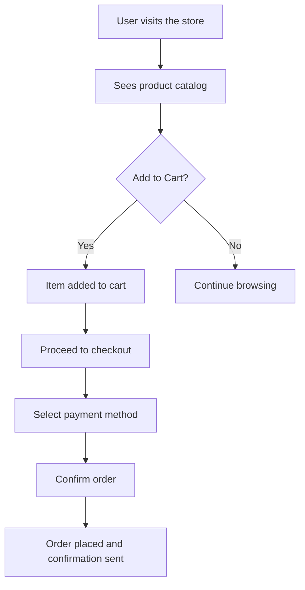
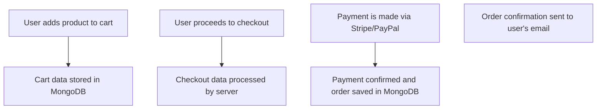
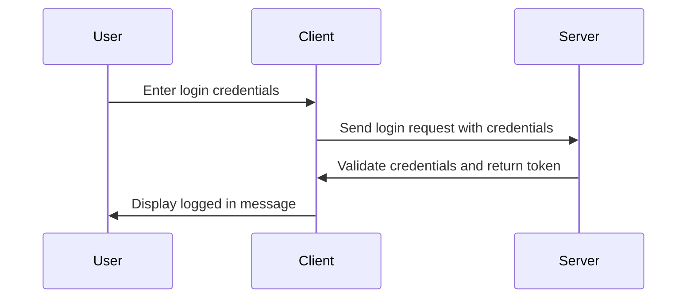
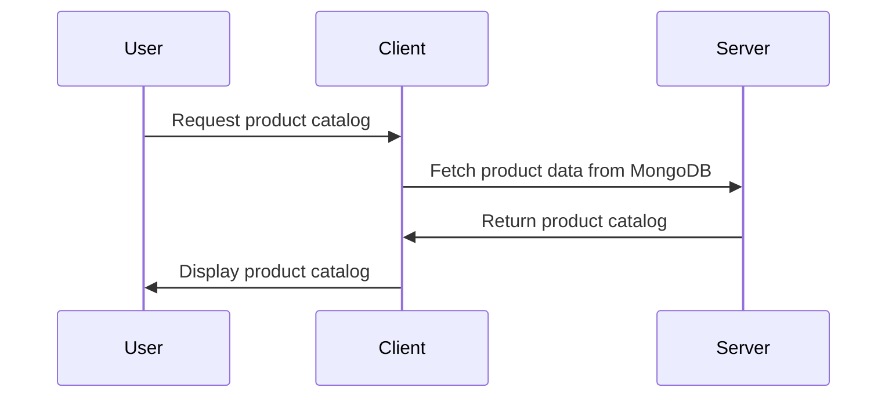
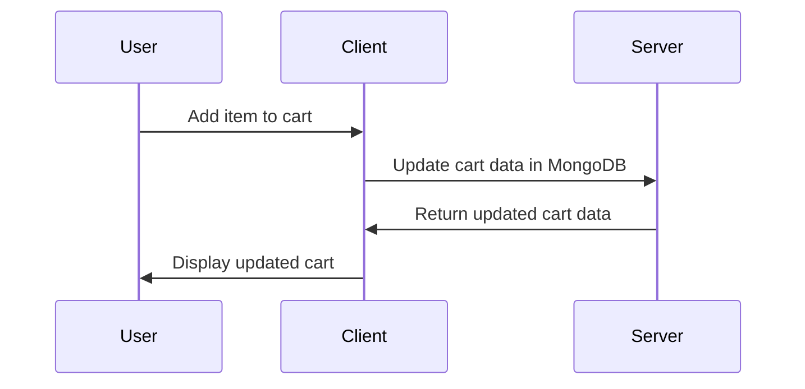
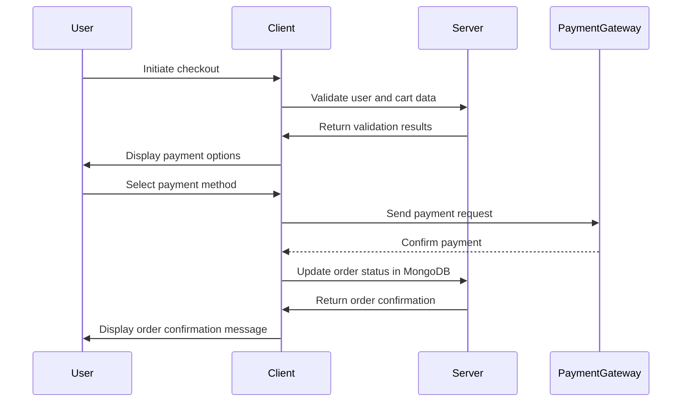

# System Design Document

## 1. System Overview
The system is a premium online store designed for independent ceramics studios to sell their products. It includes features such as a product catalog with detailed descriptions and images, shopping cart functionality, and an accessible checkout flow with multiple payment options.

## 2. Data Flow Diagrams

### Primary User Flow


### Data Processing Pipeline


## 3. Sequence Diagrams

### Authentication


### Core Feature - Product Catalog


### Core Feature - Shopping Cart


### Core Feature - Checkout


## 4. State Management Strategy
- **Client-side state:** Using React Context for managing global state such as user authentication and cart data.
- **Server-side state:** Using sessions to manage user-specific data.

## 5. Error Handling Patterns

| Error Type | Strategy | User Experience |
|-----------|----------|----------------|
| Network errors | Show error message with retry option or redirect to home page. | Inform the user that there was a problem connecting to the server and provide an option to try again later. |
| Validation errors | Highlight invalid fields and display error messages next to them. | Provide clear feedback on what is wrong with the input data and how to fix it. |
| Server errors | Show generic error message or redirect to home page. | Inform the user that there was a problem on our end and provide an option to try again later. |
| Auth errors | Redirect to login page and show error message. | Inform the user that they are not authorized to access this feature and prompt them to log in. |

## 6. Caching Strategy

| Cache Layer | Technology | TTL | Invalidation Strategy |
|------------|-----------|-----|----------------------|
| Product catalog | Redis | 1 hour | Invalidate on product update or delete |
| User session data | Redis | Session duration | Invalidate on user logout or session expiration |

## 7. Logging & Monitoring

- **Log levels:** Error, Warning, Info
  - **Error:** Capture all errors that occur during runtime.
  - **Warning:** Capture non-critical issues that may affect the system's performance.
  - **Info:** Capture general information about the system's operation.
- **Monitoring metrics:** Latency, error rate, throughput
  - **Latency:** Track response times for key endpoints to ensure a smooth user experience.
  - **Error rate:** Monitor the number of errors per minute to identify potential issues.
  - **Throughput:** Measure the number of requests processed per second to understand system capacity.
- **Alerting thresholds:** Set up alerts for high error rates, low throughput, and slow response times.

## 8. Environment Configurations

| Variable | Development | Staging | Production |
|----------|------------|---------|-----------|
| DATABASE_URL | `mongodb://localhost:27017/dev` | `mongodb://staging-db.example.com:27017/stage` | `mongodb://prod-db.example.com:27017/prod` |
| PAYMENT_GATEWAY_KEY | `dev_key` | `stage_key` | `prod_key` |
| SESSION_SECRET | `dev_secret` | `stage_secret` | `prod_secret` |

## 9. CI/CD Pipeline
```mermaid
flowchart LR
    A[Code commit] --> B[Run tests]
    B --> C{Tests pass?}
    C -- Yes --> D[Build Docker image]
    C -- No --> E[Fix issues and re-run tests]
    D --> F[Push Docker image to registry]
    F --> G[Deploy to staging environment]
    G --> H[Run integration tests]
    H --> I{Integration tests pass?}
    I -- Yes --> J[Deploy to production environment]
    I -- No --> K[Fix issues and re-run integration tests]