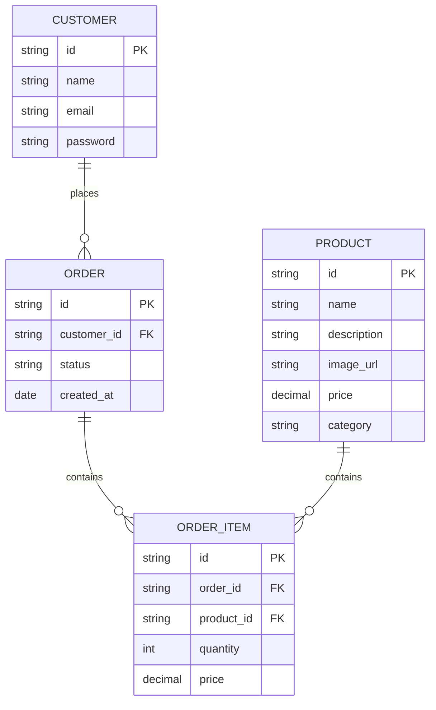

# Technical Architecture Document

## 1. Architecture Overview
The chosen architecture pattern is a **Microservices-based** architecture with a **Serverless** deployment model. This approach allows for scalability, flexibility, and easier maintenance of the system components.

### System Context Diagram (C4 Level 1)
```mermaid
graph TD
    [Independent Ceramics Studio Online Store] --> [Users]
    [Independent Ceramics Studio Online Store] --> [External Payment Gateways (Stripe, PayPal)]
    [Independent Ceramics Studio Online Store] --> [CDN for Static Assets]
    [Independent Ceramics Studio Online Store] --> [Load Balancer]
    [Independent Ceramics Studio Online Store] --> [API Gateway]
    [Independent Ceramics Studio Online Store] --> [Product Service]
    [Independent Ceramics Studio Online Store] --> [Cart Service]
    [Independent Ceramics Studio Online Store] --> [Checkout Service]
    [Independent Ceramics Studio Online Store] --> [Database (MongoDB)]
```

### Container Diagram (C4 Level 2)
```mermaid
graph TD
    [Web App Frontend]
    [API Gateway]
    [Product Service]
    [Cart Service]
    [Checkout Service]
    [Database (MongoDB)]
    [CDN for Static Assets]
    [Load Balancer]
    [External Payment Gateways (Stripe, PayPal)]
```

## 2. Tech Stack
| Layer | Technology | Version | Rationale |
|-------|-----------|---------|-----------|
| Frontend | React.js | 18.x | Provides a robust and scalable framework for building user interfaces. |
| Backend | Node.js with Express.js | 14.x | Offers a fast, unopinionated, minimalist web application framework. |
| Database | MongoDB | 6.x | Supports high performance, high availability, and automatic scaling. |
| Hosting | AWS Lambda | N/A | Serverless compute service for running code without provisioning or managing servers. |
| CDN | Amazon CloudFront | N/A | Provides fast content delivery to users worldwide. |
| Load Balancer | AWS Application Load Balancer | N/A | Distributes incoming application traffic across multiple targets, such as EC2 instances, containers, and IP addresses. |
| API Gateway | AWS API Gateway | N/A | Manages APIs at scale. |
| Payment Gateway Integration | Stripe SDK | 8.x | Provides a simple way to integrate payment processing into applications. |

### Architecture Decision Records (ADRs)
1. **Decision:** Choose React.js for the frontend.
   - **Context:** The need for a modern, scalable, and performant user interface.
   - **Options Considered:** Vue.js, Angular
   - **Rationale:** React.js offers a better developer experience with its component-based architecture and large ecosystem of libraries.

2. **Decision:** Use Node.js with Express.js for the backend.
   - **Context:** The need for a lightweight and flexible server framework.
   - **Options Considered:** Django, Ruby on Rails
   - **Rationale:** Node.js is well-suited for building scalable web applications due to its non-blocking I/O model.

3. **Decision:** Use MongoDB for the database.
   - **Context:** The need for a NoSQL database with high performance and scalability.
   - **Options Considered:** PostgreSQL, MySQL
   - **Rationale:** MongoDB provides flexibility in data modeling and is well-suited for handling unstructured data.

4. **Decision:** Choose AWS Lambda for serverless compute.
   - **Context:** The need for cost-effective and scalable backend services.
   - **Options Considered:** Azure Functions, Google Cloud Functions
   - **Rationale:** AWS Lambda allows developers to run code without provisioning or managing servers, making it ideal for microservices.

5. **Decision:** Use Amazon CloudFront for CDN.
   - **Context:** The need for fast content delivery to users worldwide.
   - **Options Considered:** Akamai, Fastly
   - **Rationale:** AWS CloudFront provides a global network of edge locations to deliver content quickly and reliably.

6. **Decision:** Choose AWS Application Load Balancer for load balancing.
   - **Context:** The need for distributing incoming application traffic across multiple targets.
   - **Options Considered:** Nginx, HAProxy
   - **Rationale:** AWS ALB provides a highly available and scalable way to distribute network and application traffic.

7. **Decision:** Use AWS API Gateway for managing APIs.
   - **Context:** The need for managing APIs at scale.
   - **Options Considered:** Swagger UI, Postman
   - **Rationale:** AWS API Gateway simplifies the process of building, publishing, maintaining, monitoring, and securing APIs.

8. **Decision:** Integrate Stripe SDK for payment processing.
   - **Context:** The need for a reliable payment gateway integration.
   - **Options Considered:** PayPal REST API, Authorize.net
   - **Rationale:** Stripe offers a simple and secure way to integrate payment processing into applications.

## 3. Database Schema
### ER Diagram


### Table Definitions
| Column | Type | Constraints | Description |
|--------|------|------------|-------------|
| customer_id | string | PK, FK | Unique identifier for the customer who placed the order. |
| order_id | string | PK, FK | Unique identifier for the order. |
| product_id | string | PK, FK | Unique identifier for the product in the order item. |
| quantity | int | NOT NULL | Number of items ordered. |
| price | decimal | NOT NULL | Price per item. |
| id | string | PK | Unique identifier for the customer. |
| name | string | NOT NULL | Name of the customer. |
| email | string | NOT NULL, UNIQUE | Email address of the customer. |
| password | string | NOT NULL | Hashed password of the customer. |
| order_id | string | PK, FK | Unique identifier for the order. |
| status | string | NOT NULL | Status of the order (e.g., pending, shipped, delivered). |
| created_at | date | NOT NULL | Timestamp when the order was created. |
| id | string | PK | Unique identifier for the product. |
| name | string | NOT NULL | Name of the product. |
| description | string | NOT NULL | Description of the product. |
| image_url | string | NOT NULL | URL to the product image. |
| price | decimal | NOT NULL | Price of the product. |
| category | string | NOT NULL | Category of the product. |

## 4. API Design
### GET /products
- **Description:** Retrieve a list of all products.
- **Auth Required:** No
- **Request Body:** None
- **Response:**
    ```json
    {
        "products": [
            {
                "id": "1",
                "name": "Product 1",
                "description": "Description of Product 1",
                "image_url": "https://example.com/product1.jpg",
                "price": 29.99,
                "category": "Category A"
            },
            {
                "id": "2",
                "name": "Product 2",
                "description": "Description of Product 2",
                "image_url": "https://example.com/product2.jpg",
                "price": 19.99,
                "category": "Category B"
            }
        ]
    }
    ```
- **Error Codes:** None

### GET /products/{id}
- **Description:** Retrieve details of a specific product.
- **Auth Required:** No
- **Request Body:** None
- **Response:**
    ```json
    {
        "product": {
            "id": "1",
            "name": "Product 1",
            "description": "Description of Product 1",
            "image_url": "https://example.com/product1.jpg",
            "price": 29.99,
            "category": "Category A"
        }
    }
    ```
- **Error Codes:** None

### POST /cart
- **Description:** Add an item to the shopping cart.
- **Auth Required:** Yes
- **Request Body:**
    ```json
    {
        "product_id": "1",
        "quantity": 2
    }
    ```
- **Response:**
    ```json
    {
        "message": "Item added to cart successfully"
    }
    ```
- **Error Codes:** None

### GET /cart
- **Description:** Retrieve the current shopping cart.
- **Auth Required:** Yes
- **Request Body:** None
- **Response:**
    ```json
    {
        "cart_items": [
            {
                "product_id": "1",
                "quantity": 2,
                "price": 29.99
            }
        ],
        "total_price": 59.98
    }
    ```
- **Error Codes:** None

### DELETE /cart/{item_id}
- **Description:** Remove an item from the shopping cart.
- **Auth Required:** Yes
- **Request Body:** None
- **Response:**
    ```json
    {
        "message": "Item removed from cart successfully"
    }
    ```
- **Error Codes:** None

### POST /checkout
- **Description:** Process the checkout and create an order.
- **Auth Required:** Yes
- **Request Body:**
    ```json
    {
        "payment_method": "stripe",
        "card_number": "4242424242424242",
        "expiry_month": 12,
        "expiry_year": 2025,
        "cvv": "123"
    }
    ```
- **Response:**
    ```json
    {
        "order_id": "1",
        "status": "pending"
    }
    ```
- **Error Codes:** None

## 5. Authentication & Authorization
- **Auth Strategy:** JWT (JSON Web Tokens)
- **Role Definitions:** Customer, Admin
- **Permission Model:** Role-based access control (RBAC)
- **Token Lifecycle:** Tokens are issued upon successful authentication and expire after a set period.

## 6. Deployment Architecture
```mermaid
graph TD
    [CDN for Static Assets] --> [Web App Frontend]
    [Load Balancer] --> [API Gateway]
    [API Gateway] --> [Product Service]
    [API Gateway] --> [Cart Service]
    [API Gateway] --> [Checkout Service]
    [Database (MongoDB)] --> [Product Service]
    [Database (MongoDB)] --> [Cart Service]
    [Database (MongoDB)] --> [Checkout Service]
    [External Payment Gateways (Stripe, PayPal)] --> [Checkout Service]
```

## 7. Security Considerations
Apply STRIDE threat model:
| Threat | Category | Mitigation |
|--------|---------|------------|
| Spoofing/Tampering | Authentication | Use JWT for secure authentication and validate tokens on each request. |
| Injection | SQL Injection | Use parameterized queries to prevent SQL injection attacks. |
| Brute Force | Login | Implement rate limiting and lockout mechanisms after multiple failed login attempts. |
| Denial of Service (DoS) | Network | Use AWS WAF for DDoS protection. |
| Eavesdropping | Data Transmission | Encrypt data in transit using HTTPS. |
| Repudiation | Transactions | Ensure that transactions are irreversible by using a secure payment gateway and logging all transactions. |

## 8. Scalability & Performance
- **Expected Load:** Up to 10,000 concurrent users.
- **Bottleneck Analysis:** The most likely bottleneck will be the database due to high read/write operations.
- **Scaling Strategy:** Horizontal scaling for both frontend and backend services using auto-scaling groups.
- **Caching Strategy:** Use Redis for caching frequently accessed data such as product details and cart items.
- **CDN Usage:** Deploy static assets on AWS S3 with CloudFront CDN for fast content delivery.