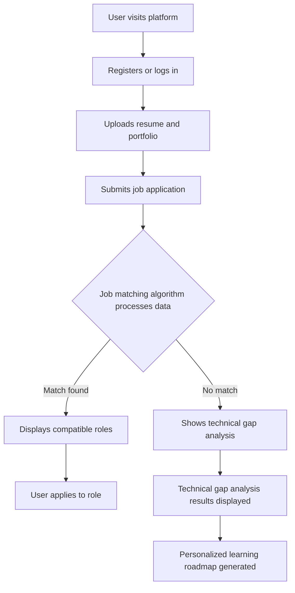
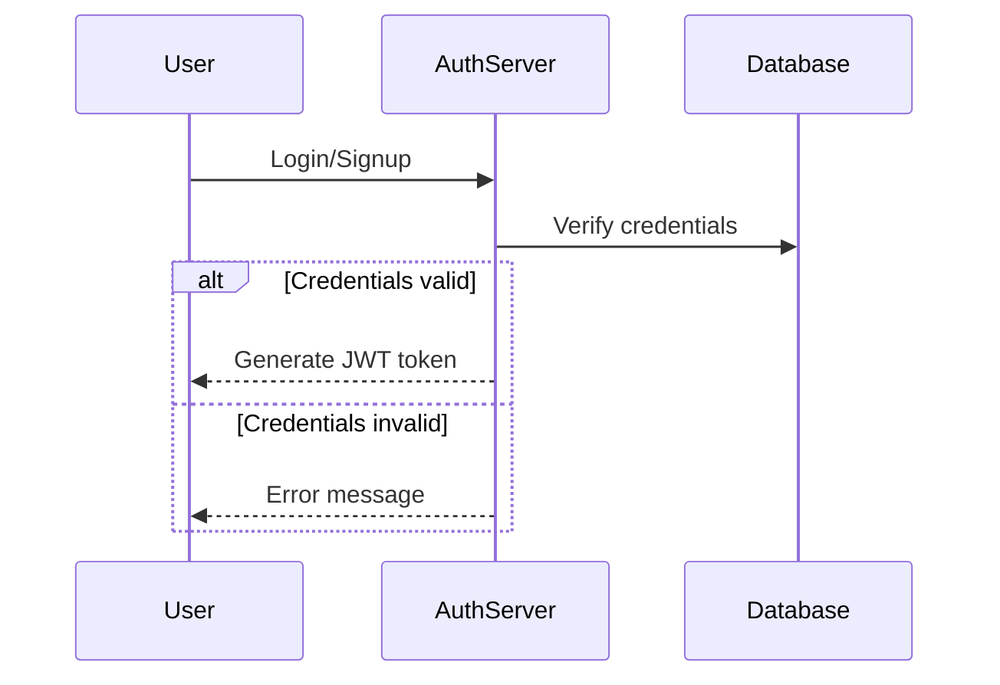
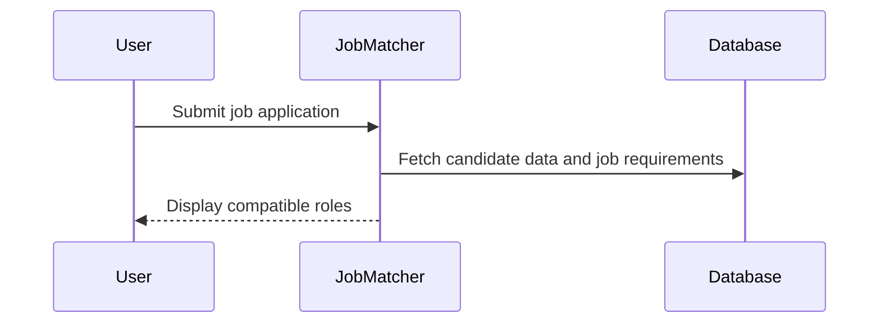
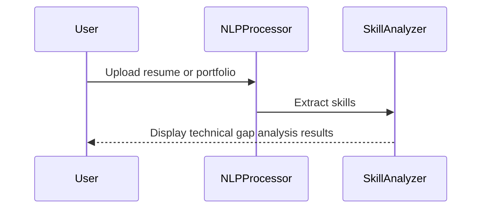
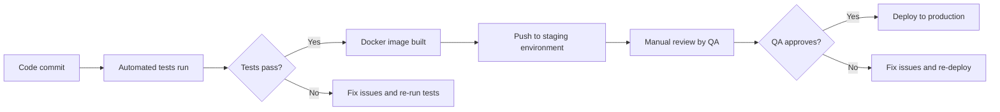

# System Design Document

## 1. System Overview
The system is a web-based career navigation platform designed to help entry-level candidates identify roles that align with their skills and technical gaps. It uses machine learning algorithms for job matching and natural language processing (NLP) for technical gap analysis, providing personalized career development recommendations.

## 2. Data Flow Diagrams

### Primary User Flow


### Data Processing Pipeline
```mermaid
flowchart TD
    A[Unstructured candidate data (resume, portfolio)] --> B[NLP processes text for skill extraction]
    B --> C[Machine learning model predicts role compatibility]
    C --> D[Technical gap analysis identifies missing skills]
    D --> E[Personalized learning roadmap generated]
```

## 3. Sequence Diagrams

### Authentication


### Job Matching Algorithm


### Technical Gap Analysis


## 4. State Management Strategy
- **Client-side state:** React Context for managing user session data and application state.
- **Server-side state:** Sessions for storing user authentication state.

## 5. Error Handling Patterns

| Error Type | Strategy | User Experience |
|-----------|----------|----------------|
| Network errors | Show error message with retry option | Inform user of network issue and provide a retry button. |
| Validation errors | Highlight invalid fields and show error messages | Display validation errors immediately upon form submission. |
| Server errors | Log error, display generic error message | Log server-side errors for debugging and display a user-friendly error message. |
| Auth errors | Redirect to login page with error message | Inform the user of authentication failure and redirect them to the login page. |

## 6. Caching Strategy

| Cache Layer | Technology | TTL | Invalidation Strategy |
|------------|-----------|-----|----------------------|
| Job Matching Results | Redis | 1 hour | Invalidate on new data or job posting updates. |
| Technical Gap Analysis | Redis | 30 minutes | Invalidate on new data or candidate uploads. |

## 7. Logging & Monitoring

- **Log levels:** Error, Warning, Info
  - **Error:** Critical system failures.
  - **Warning:** Non-critical issues that may affect functionality.
  - **Info:** Normal operations and status updates.

- **Monitoring metrics:**
  - Latency of job matching algorithm
  - Error rate for technical gap analysis
  - Throughput of user requests

- **Alerting thresholds:**
  - Latency > 500ms: Warning
  - Error rate > 1%: Critical

## 8. Environment Configurations

| Variable | Development | Staging | Production |
|----------|------------|---------|-----------|
| API_KEY | dev_api_key | stage_api_key | prod_api_key |
| DB_URL | dev_db_url | stage_db_url | prod_db_url |

## 9. CI/CD Pipeline


This comprehensive System Design Document outlines the architecture, data flows, error handling, and other critical aspects of the career navigation platform.