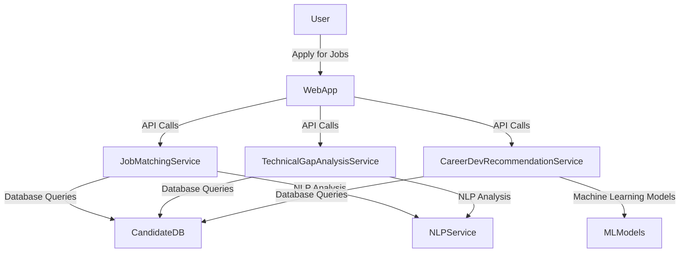
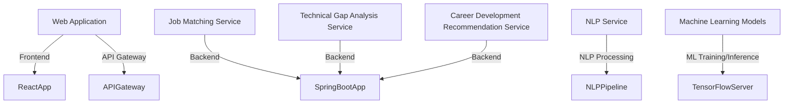
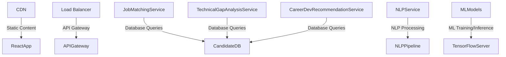

# Technical Architecture Document

## 1. Architecture Overview
The chosen architecture pattern is a **Microservices-based** architecture with a **Serverless** approach to handle scalability and operational simplicity. The system will be hosted on AWS, leveraging its robust infrastructure services.

### System Context Diagram (C4 Level 1)


### Container Diagram (C4 Level 2)


## 2. Tech Stack
| Layer | Technology | Version | Rationale |
|-------|-----------|---------|-----------|
| Frontend | React.js | 17.x | User-friendly interface and modern JavaScript framework |
| Backend | Spring Boot | 2.5.x | Robust, scalable backend with Java ecosystem |
| Database | Amazon RDS (PostgreSQL) | 13.x | Scalable, relational database for structured data |
| NLP Processing | AWS Comprehend | Latest | Natural language processing capabilities |
| Machine Learning Models | TensorFlow Serving | Latest | Scalable serving of machine learning models |
| Hosting | AWS Lambda | Latest | Serverless compute for microservices |
| API Gateway | Amazon API Gateway | Latest | Management and security for APIs |

### Architecture Decision Records (ADRs)
1. **Decision:** Use React.js for the frontend
   - **Context:** Need a modern, user-friendly interface with good developer support.
   - **Options Considered:** Angular, Vue.js, Svelte
   - **Rationale:** React.js has a large community and extensive ecosystem.

2. **Decision:** Use Spring Boot for the backend
   - **Context:** Need a robust, scalable backend with Java ecosystem.
   - **Options Considered:** Node.js, Python Flask/Django, .NET Core
   - **Rationale:** Spring Boot provides comprehensive features out-of-the-box and is well-suited for enterprise-level applications.

3. **Decision:** Use Amazon RDS (PostgreSQL) for the database
   - **Context:** Need a scalable, relational database for structured data.
   - **Options Considered:** MySQL, MongoDB, DynamoDB
   - **Rationale:** PostgreSQL offers robust transactional capabilities and is well-suited for complex queries.

4. **Decision:** Use AWS Comprehend for NLP processing
   - **Context:** Need natural language processing capabilities.
   - **Options Considered:** Custom NLP models, open-source libraries
   - **Rationale:** AWS Comprehend provides pre-built models and is managed by AWS, reducing operational overhead.

5. **Decision:** Use TensorFlow Serving for machine learning models
   - **Context:** Need scalable serving of machine learning models.
   - **Options Considered:** Custom server implementation, open-source libraries
   - **Rationale:** TensorFlow Serving provides a standardized way to serve ML models and is well-maintained by the community.

## 3. Database Schema
### ER Diagram
```mermaid
erDiagram
    CANDIDATE {
        INT id PK
        VARCHAR name
        TEXT resume
        TEXT portfolio
        TEXT education
    }
    JOB {
        INT id PK
        VARCHAR title
        TEXT description
        TEXT requirements
    }
    SKILL {
        INT id PK
        VARCHAR name
    }
    CANDIDATE_SKILL {
        INT candidate_id FK
        INT skill_id FK
        PRIMARY KEY (candidate_id, skill_id)
    }
```

### Table Definitions
| Column | Type | Constraints | Description |
|--------|------|------------|-------------|
| id     | INT  | PK         | Unique identifier for each record |
| name   | VARCHAR |            | Name of the candidate or job title |
| resume | TEXT |            | Unstructured resume text |
| portfolio | TEXT |            | Unstructured portfolio text |
| education | TEXT |            | Unstructured education details |
| id     | INT  | PK         | Unique identifier for each record |
| title  | VARCHAR |            | Title of the job |
| description | TEXT |            | Description of the job responsibilities |
| requirements | TEXT |            | Requirements for the job |

## 4. API Design
### GET /api/jobs
- **Description:** Retrieve a list of jobs based on candidate skills and requirements.
- **Auth Required:** Yes
- **Request Body:** None
- **Response:**
    ```json
    {
        "jobs": [
            {
                "id": 1,
                "title": "Software Engineer",
                "description": "Develop scalable software solutions...",
                "requirements": "Proficient in Java, Spring Boot..."
            }
        ]
    }
    ```
- **Error Codes:** 401 Unauthorized, 500 Internal Server Error

### POST /api/gap-analysis
- **Description:** Analyze technical gaps for a candidate based on job requirements.
- **Auth Required:** Yes
- **Request Body:**
    ```json
    {
        "candidateId": 1,
        "jobId": 1
    }
    ```
- **Response:**
    ```json
    {
        "gaps": [
            {
                "skill": "Java",
                "level": "Intermediate"
            },
            {
                "skill": "Spring Boot",
                "level": "Basic"
            }
        ]
    }
    ```
- **Error Codes:** 401 Unauthorized, 500 Internal Server Error

### GET /api/recommendations
- **Description:** Get personalized career development recommendations for a candidate.
- **Auth Required:** Yes
- **Request Body:** None
- **Response:**
    ```json
    {
        "recommendations": [
            {
                "skill": "Java",
                "level": "Intermediate",
                "resources": ["Coursera courses", "Books"]
            },
            {
                "skill": "Spring Boot",
                "level": "Basic",
                "resources": ["Udemy course", "YouTube tutorials"]
            }
        ]
    }
    ```
- **Error Codes:** 401 Unauthorized, 500 Internal Server Error

## 5. Authentication & Authorization
- Auth strategy: JWT (JSON Web Tokens)
- Role definitions: User, Admin
- Permission model: Role-based access control
- Token lifecycle: Issued on login, refreshed upon expiration

## 6. Deployment Architecture


## 7. Security Considerations
Apply STRIDE threat model:
| Threat | Category | Mitigation |
|--------|---------|------------|
| Spoofing | Authentication | Use JWT for secure token-based authentication |
| Tampering | Data Integrity | Encrypt sensitive data at rest and in transit using HTTPS |
| Repudiation | Audit Trails | Maintain audit logs for all actions performed by users |
| Information Disclosure | Access Control | Implement role-based access control to restrict access to sensitive data |
| Denial of Service | Load Balancing | Use a load balancer with auto-scaling capabilities to handle high traffic |
| Elevation of Privilege | Least Privilege Principle | Ensure that users have only the minimum privileges required for their roles |

## 8. Scalability & Performance
- Expected load: 10,000 concurrent users, 500 requests/sec
- Bottleneck analysis: Database queries and NLP processing are potential bottlenecks
- Scaling strategy: Horizontal scaling (auto-scaling groups) for web app and services
- Caching strategy: Use Redis for caching frequently accessed data
- CDN usage: Deploy a CDN to serve static content and reduce latency

This document provides a comprehensive technical architecture for the career navigation platform, ensuring that all components are well-documented and aligned with the project requirements.