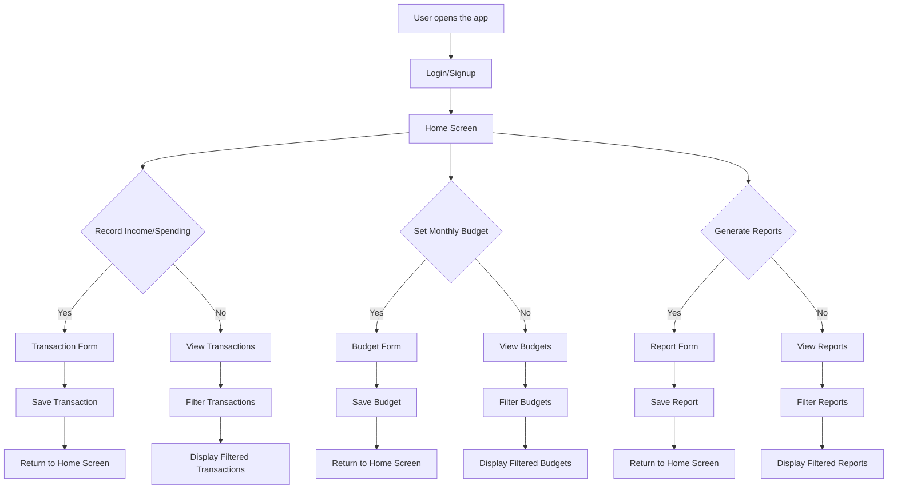
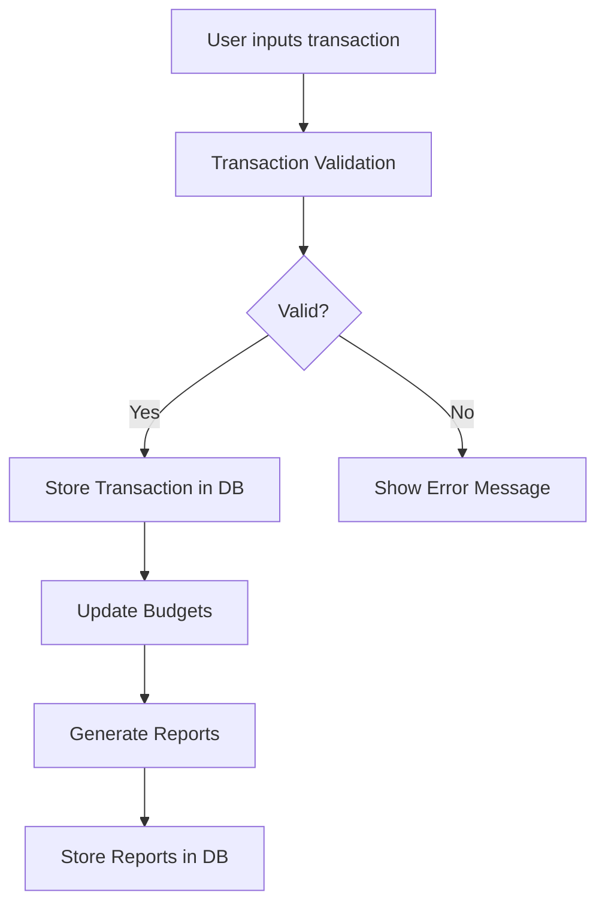
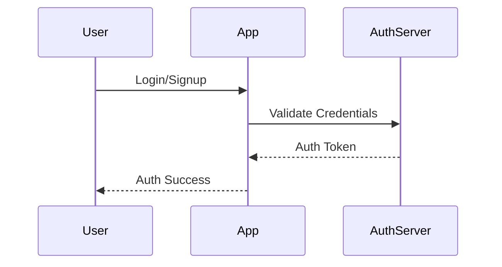
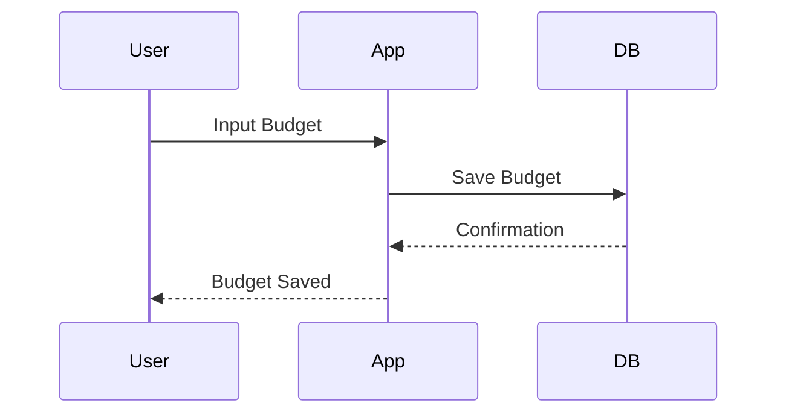
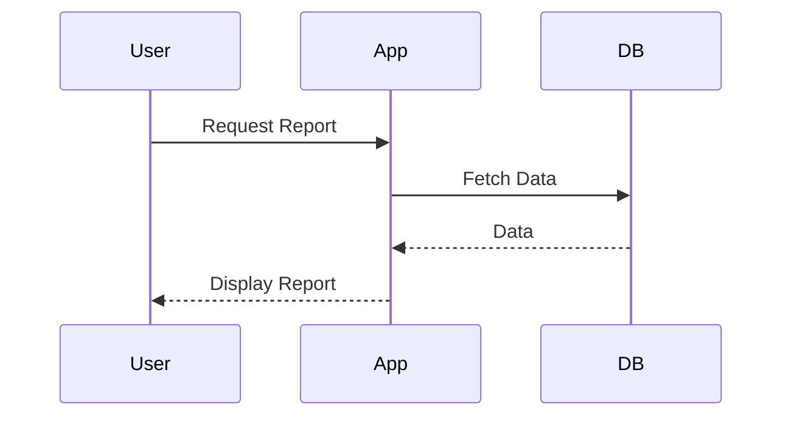

# System Design Document

## 1. System Overview
The Unnamed Project is a comprehensive expense management tool designed to help users track their income and spending, categorize transactions, set budgets, view financial charts, suggest reductions in unnecessary expenses, and predict future spending using AI.

## 2. Data Flow Diagrams
### Primary User Flow


### Data Processing Pipeline


## 3. Sequence Diagrams
### Authentication


### Core Feature - Record Income/Spending


### Core Feature - Set Monthly Budgets


### Core Feature - Generate Reports


## 4. State Management Strategy
- **Client-side state:** React Context for global state management.
- **Server-side state:** PostgreSQL sessions for user-specific data persistence.

## 5. Error Handling Patterns
| Error Type | Strategy | User Experience |
|-----------|----------|----------------|
| Network errors | Show error message and retry option | Inform the user of network issues and provide a retry button. |
| Validation errors | Highlight invalid fields and show error messages | Display clear, actionable error messages next to input fields. |
| Server errors | Log error and show generic error message | Log server-side errors for debugging and display a generic error message to the user. |
| Auth errors | Redirect to login page with error message | Redirect the user to the login screen and display an error message if authentication fails. |

## 6. Caching Strategy
| Cache Layer | Technology | TTL | Invalidation Strategy |
|------------|-----------|-----|----------------------|
| User Data | Redis | 1 hour | Invalidate on user logout or data change |
| Reports | Memcached | 30 minutes | Invalidate on data change or report generation |

## 7. Logging & Monitoring
- **Log levels:** Info, Warning, Error.
- **Monitoring metrics:** Transaction count, budget adherence rate, error rate.
- **Alerting thresholds:** High error rates, low transaction activity.

## 8. Environment Configurations
| Variable | Development | Staging | Production |
|----------|------------|---------|-----------|
| DB_HOST | localhost | staging-db.example.com | prod-db.example.com |
| API_KEY | dev-api-key | staging-api-key | prod-api-key |

## 9. CI/CD Pipeline
```mermaid
flowchart LR
    A[Code Commit] --> B[Unit Tests]
    B --> C[Integration Tests]
    C --> D[Build App]
    D --> E[Deploy to Staging]
    E --> F[Manual QA on Staging]
    F -- Pass --> G[Deploy to Production]
    F -- Fail --> H[Fix Issues and Repeat]