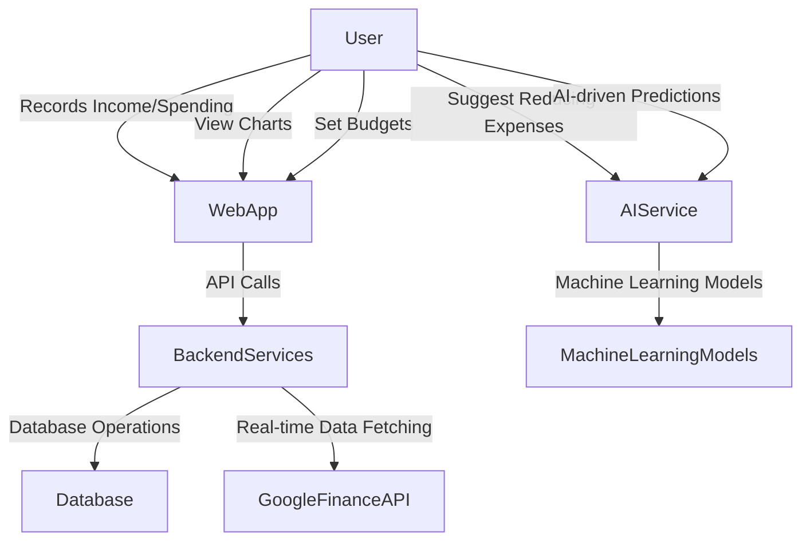
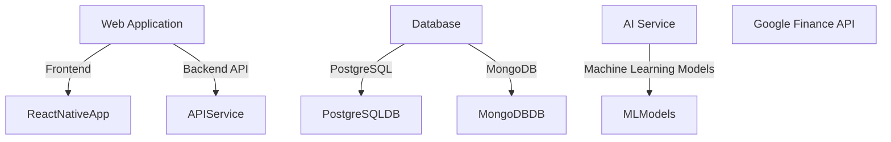
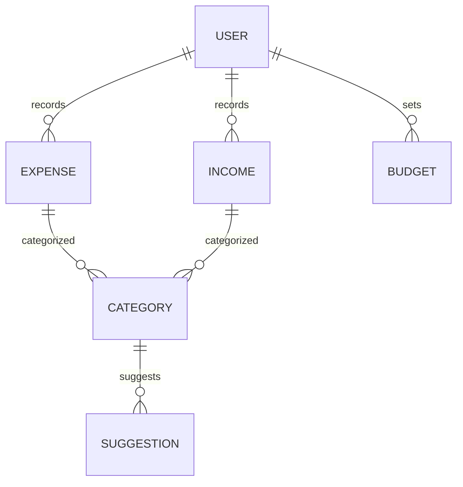
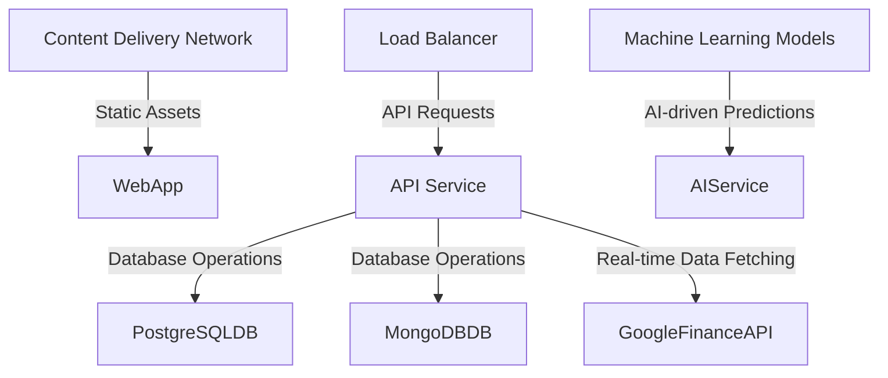

# Technical Architecture Document

## 1. Architecture Overview
The chosen architecture pattern is a **Microservices-based** design with a **Serverless** deployment model. This approach allows for scalability, flexibility, and easier maintenance of the system.

### System Context Diagram (C4 Level 1)


### Container Diagram (C4 Level 2)


## 2. Tech Stack

| Layer | Technology | Version | Rationale |
|-------|-----------|---------|-----------|
| Frontend | React Native | 0.64 | Cross-platform mobile app development with a rich UI experience |
| Backend | Node.js | 14.x | Serverless and scalable backend environment |
| Database | PostgreSQL | 13.x | Relational database for structured data storage |
| Database | MongoDB | 4.4.x | NoSQL database for flexible data storage |
| Data Visualization | Chart.js | 2.9.x | JavaScript library for creating interactive charts |
| Machine Learning | TensorFlow Lite | 2.4.x | Lightweight machine learning framework for mobile devices |
| APIs | Google Finance API | Latest | Real-time financial data and analysis |

### Architecture Decision Records (ADRs)

1. **Decision:** Choose React Native for the frontend
   - **Context:** Need a cross-platform app that supports both iOS and Android.
   - **Options Considered:** Flutter, Vue.js, Angular
   - **Rationale:** React Native offers better performance and a more mature ecosystem compared to other options.

2. **Decision:** Use Node.js with Serverless for the backend
   - **Context:** Need a scalable and cost-effective backend solution.
   - **Options Considered:** Java Spring Boot, Python Flask/Django, Ruby on Rails
   - **Rationale:** Node.js is well-suited for serverless architectures and has a large community.

3. **Decision:** Use PostgreSQL for the relational database
   - **Context:** Need a robust relational database for structured data.
   - **Options Considered:** MySQL, Oracle, Microsoft SQL Server
   - **Rationale:** PostgreSQL offers advanced features like ACID compliance and extensibility.

4. **Decision:** Use MongoDB for the NoSQL database
   - **Context:** Need a flexible database for storing unstructured or semi-structured data.
   - **Options Considered:** Cassandra, Couchbase, Redis
   - **Rationale:** MongoDB provides high performance and scalability with its document-oriented model.

5. **Decision:** Use Chart.js for data visualization
   - **Context:** Need an interactive chart library for visualizing financial data.
   - **Options Considered:** D3.js, Highcharts, Google Charts
   - **Rationale:** Chart.js is lightweight and easy to use with React Native.

6. **Decision:** Use TensorFlow Lite for machine learning models
   - **Context:** Need a lightweight ML framework for mobile devices.
   - **Options Considered:** PyTorch, Keras, Scikit-learn
   - **Rationale:** TensorFlow Lite offers better performance and compatibility with mobile platforms.

7. **Decision:** Use Google Finance API for real-time data fetching
   - **Context:** Need access to up-to-date financial data.
   - **Options Considered:** Yahoo Finance API, Alpha Vantage API
   - **Rationale:** Google Finance API provides comprehensive and accurate financial data.

## 3. Database Schema

### ER Diagram


### Table Definitions

| Column | Type | Constraints | Description |
|--------|------|------------|-------------|
| USER_ID | UUID | PRIMARY KEY, NOT NULL | Unique identifier for each user |
| USERNAME | VARCHAR(50) | UNIQUE, NOT NULL | Username of the user |
| EMAIL | VARCHAR(100) | UNIQUE, NOT NULL | Email address of the user |
| PASSWORD | VARCHAR(255) | NOT NULL | Hashed password of the user |
| EXPENSE_ID | UUID | PRIMARY KEY, NOT NULL | Unique identifier for each expense record |
| USER_ID | UUID | FOREIGN KEY REFERENCES USER(USER_ID), NOT NULL | Foreign key to the user who recorded the expense |
| AMOUNT | DECIMAL(10, 2) | NOT NULL | Amount of the expense |
| CATEGORY_ID | UUID | FOREIGN KEY REFERENCES CATEGORY(CATEGORY_ID), NOT NULL | Foreign key to the category of the expense |
| DATE | TIMESTAMP | NOT NULL | Date and time when the expense was recorded |
| INCOME_ID | UUID | PRIMARY KEY, NOT NULL | Unique identifier for each income record |
| USER_ID | UUID | FOREIGN KEY REFERENCES USER(USER_ID), NOT NULL | Foreign key to the user who recorded the income |
| AMOUNT | DECIMAL(10, 2) | NOT NULL | Amount of the income |
| CATEGORY_ID | UUID | FOREIGN KEY REFERENCES CATEGORY(CATEGORY_ID), NOT NULL | Foreign key to the category of the income |
| DATE | TIMESTAMP | NOT NULL | Date and time when the income was recorded |
| BUDGET_ID | UUID | PRIMARY KEY, NOT NULL | Unique identifier for each budget record |
| USER_ID | UUID | FOREIGN KEY REFERENCES USER(USER_ID), NOT NULL | Foreign key to the user who set the budget |
| CATEGORY_ID | UUID | FOREIGN KEY REFERENCES CATEGORY(CATEGORY_ID), NOT NULL | Foreign key to the category of the budget |
| AMOUNT | DECIMAL(10, 2) | NOT NULL | Amount allocated for the budget |
| START_DATE | TIMESTAMP | NOT NULL | Start date of the budget period |
| END_DATE | TIMESTAMP | NOT NULL | End date of the budget period |
| CATEGORY_ID | UUID | FOREIGN KEY REFERENCES CATEGORY(CATEGORY_ID), NOT NULL | Foreign key to the category of the suggestion |
| SUGGESTION | VARCHAR(255) | NOT NULL | Suggested action to reduce unnecessary expenses |

## 4. API Design

### POST /api/expense
- **Description:** Records a new expense
- **Auth Required:** Yes
- **Request Body:**
    ```json
    {
        "amount": 100.00,
        "category_id": "UUID",
        "date": "2023-04-01T12:00:00Z"
    }
    ```
- **Response:** 
    ```json
    {
        "expense_id": "UUID",
        "user_id": "UUID",
        "amount": 100.00,
        "category_id": "UUID",
        "date": "2023-04-01T12:00:00Z"
    }
    ```
- **Error Codes:** 
    - 400: Invalid request body
    - 401: Unauthorized

### GET /api/expense/user/{user_id}
- **Description:** Retrieves all expenses for a user
- **Auth Required:** Yes
- **Response:** 
    ```json
    [
        {
            "expense_id": "UUID",
            "user_id": "UUID",
            "amount": 100.00,
            "category_id": "UUID",
            "date": "2023-04-01T12:00:00Z"
        },
        ...
    ]
    ```
- **Error Codes:** 
    - 401: Unauthorized
    - 404: User not found

### POST /api/income
- **Description:** Records a new income
- **Auth Required:** Yes
- **Request Body:**
    ```json
    {
        "amount": 500.00,
        "category_id": "UUID",
        "date": "2023-04-01T12:00:00Z"
    }
    ```
- **Response:** 
    ```json
    {
        "income_id": "UUID",
        "user_id": "UUID",
        "amount": 500.00,
        "category_id": "UUID",
        "date": "2023-04-01T12:00:00Z"
    }
    ```
- **Error Codes:** 
    - 400: Invalid request body
    - 401: Unauthorized

### GET /api/income/user/{user_id}
- **Description:** Retrieves all incomes for a user
- **Auth Required:** Yes
- **Response:** 
    ```json
    [
        {
            "income_id": "UUID",
            "user_id": "UUID",
            "amount": 500.00,
            "category_id": "UUID",
            "date": "2023-04-01T12:00:00Z"
        },
        ...
    ]
    ```
- **Error Codes:** 
    - 401: Unauthorized
    - 404: User not found

### POST /api/budget
- **Description:** Sets a new budget
- **Auth Required:** Yes
- **Request Body:**
    ```json
    {
        "amount": 2000.00,
        "start_date": "2023-04-01T00:00:00Z",
        "end_date": "2023-05-01T00:00:00Z"
    }
    ```
- **Response:** 
    ```json
    {
        "budget_id": "UUID",
        "user_id": "UUID",
        "amount": 2000.00,
        "start_date": "2023-04-01T00:00:00Z",
        "end_date": "2023-05-01T00:00:00Z"
    }
    ```
- **Error Codes:** 
    - 400: Invalid request body
    - 401: Unauthorized

### GET /api/budget/user/{user_id}
- **Description:** Retrieves all budgets for a user
- **Auth Required:** Yes
- **Response:** 
    ```json
    [
        {
            "budget_id": "UUID",
            "user_id": "UUID",
            "amount": 2000.00,
            "start_date": "2023-04-01T00:00:00Z",
            "end_date": "2023-05-01T00:00:00Z"
        },
        ...
    ]
    ```
- **Error Codes:** 
    - 401: Unauthorized
    - 404: User not found

## 5. Authentication & Authorization

- **Auth Strategy:** JWT (JSON Web Tokens)
- **Role Definitions:** User, Admin
- **Permission Model:** Role-based access control
- **Token Lifecycle:** Tokens are issued upon successful authentication and expire after a set period.

## 6. Deployment Architecture


## 7. Security Considerations

Apply STRIDE threat model:

| Threat | Category | Mitigation |
|--------|---------|------------|
| Spoofing | Authentication | Use JWT with a secure secret key and refresh tokens |
| Tampering | Data Integrity | Encrypt sensitive data at rest and in transit using HTTPS |
| Repudiation | Audit Trail | Maintain an audit log of all user actions for accountability |
| Information Disclosure | Access Control | Implement role-based access control to restrict access to sensitive data |
| Denial of Service | Load Balancing | Use a load balancer to distribute traffic across multiple servers and mitigate DDoS attacks |
| Elevation of Privilege | Role Management | Limit the privileges of each user based on their role |

## 8. Scalability & Performance

- **Expected Load:** Up to 10,000 concurrent users
- **Bottleneck Analysis:** Database operations and real-time data fetching are potential bottlenecks.
- **Scaling Strategy:** Horizontal scaling using load balancers and auto-scaling groups for backend services.
- **Caching Strategy:** Use Redis for caching frequently accessed data like user profiles and expense/income records.
- **CDN Usage:** Deploy a CDN to serve static assets and reduce latency for users globally.